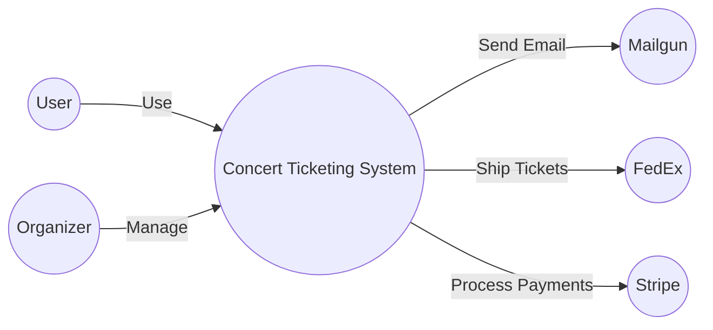
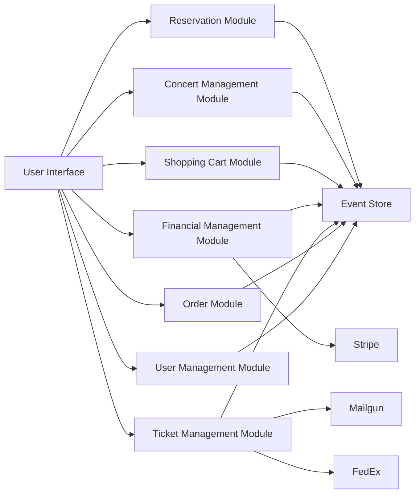
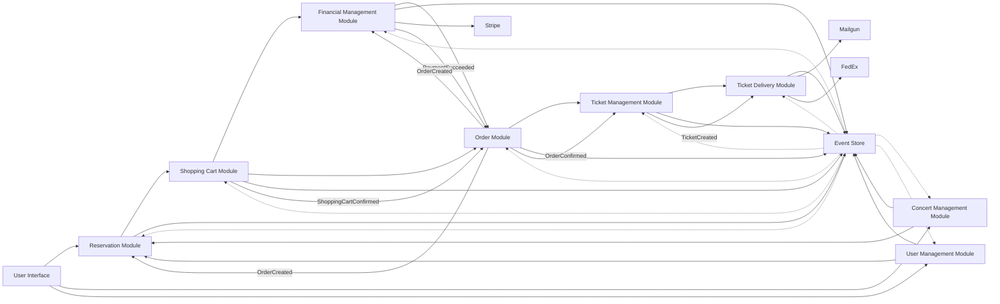
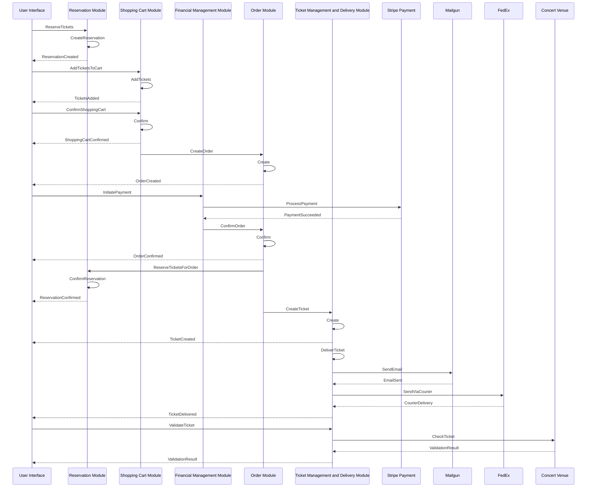

# Event Sourcing on Production Workshop

- [Event Sourcing on Production Workshop](#event-sourcing-on-production-workshop)
  - [DISCLAIMER](#disclaimer)
  - [Overview](#overview)
    - [1. Concert Management](#1-concert-management)
    - [2. Shopping Cart](#2-shopping-cart)
    - [3. Reservation](#3-reservation)
    - [4. Order Management](#4-order-management)
    - [5. Ticket Management and Delivery](#5-ticket-management-and-delivery)
    - [6. Financial](#6-financial)
    - [7. User Management Module](#7-user-management-module)
  - [Architecture](#architecture)
  - [C4 model](#c4-model)
    - [System](#system)
    - [Container](#container)
    - [Component](#component)
  - [Bounded Contexts, Aggregates, Commands, and Events](#bounded-contexts-aggregates-commands-and-events)
    - [1. Concert Management Module](#1-concert-management-module)
      - [Summary](#summary)
      - [Flow](#flow)
      - [Concert Aggregate](#concert-aggregate)
      - [Concert Details Read Model](#concert-details-read-model)
      - [Available Concerts Read Model](#available-concerts-read-model)
    - [2. Shopping Cart Module](#2-shopping-cart-module)
      - [Summary](#summary-1)
      - [Flow](#flow-1)
      - [Shopping Cart Aggregate](#shopping-cart-aggregate)
      - [Shopping Cart Contents Read Model](#shopping-cart-contents-read-model)
      - [Shopping Cart Summary Read Model](#shopping-cart-summary-read-model)
    - [3. Reservation Module](#3-reservation-module)
      - [Summary](#summary-2)
      - [Flow](#flow-2)
      - [Reservation](#reservation)
      - [Concert Availability](#concert-availability)
      - [User Reservations Read Model](#user-reservations-read-model)
      - [Concert Reservations Read Model](#concert-reservations-read-model)
    - [4. Order Management Module](#4-order-management-module)
      - [Summary](#summary-3)
      - [Flow](#flow-3)
      - [Order Aggregate](#order-aggregate)
      - [User Orders Read model](#user-orders-read-model)
      - [Order Details Read model](#order-details-read-model)
    - [5. Ticket Management And Delivery Module](#5-ticket-management-and-delivery-module)
      - [Summary](#summary-4)
      - [Flow](#flow-4)
      - [Ticket Aggregate](#ticket-aggregate)
      - [Ticket Delivery Aggregate](#ticket-delivery-aggregate)
      - [Integration with External Email Provider](#integration-with-external-email-provider)
      - [User Tickets Read Model](#user-tickets-read-model)
      - [Ticket Details Read Model](#ticket-details-read-model)
      - [Concert Ticket Summary Read Model](#concert-ticket-summary-read-model)
      - [Ticket Delivery Status Read Model](#ticket-delivery-status-read-model)
      - [Ticket Validation Status Read Model](#ticket-validation-status-read-model)
    - [6. Financial Module](#6-financial-module)
    - [Flow](#flow-5)
      - [Payment](#payment)
      - [Invoice](#invoice)
      - [Integration with External Payment Gateway](#integration-with-external-payment-gateway)
      - [User Payments Read Model](#user-payments-read-model)
      - [Payment Details Read Model](#payment-details-read-model)
      - [User Invoices Read Model](#user-invoices-read-model)
      - [Invoice Details Read Model](#invoice-details-read-model)
    - [7. User Management Module](#7-user-management-module-1)

## DISCLAIMER

**THIS IS NOT AN EXAMPLE OF HOW YOU SHOULD IMPLEMENT EVENT SOURCING ON PRODUCTION.** 

The content was generated by long discussions with ChatGPT and additonal changes. It's a starting point for a discussions and exercises for the workshop. It appears (surprise!) that ChatGPT is a great source for the code that looks fine, and close to what you could see in some real-world projects. Yet it brings a significant flaws and mistakes, that might not be easy to spot and will ends up badly on production.

**So please, don't copy it, but look for issues like:**
- how to handle versioning when schema would change?
- how to handle consistency and changes to multiple aggregates in the same eventStore (e.g. in reservation)?
- how would you handle distributed process coordination? E.g. order management, and cases like idempotency, ordering and delivery guarantees?
- how to integrate with external systems in event-driven approach?
- how (not) to model events?
- how to shape boundaries between systems?

## Overview

Imagine you're organizing a Beyonce concert in Warsaw, and you need a system to manage every aspect of the event, from ticket reservations to financial transactions. Our system has you covered with the following modules:

### [1. Concert Management](#concert-management-module)
    
This module takes care of all the behind-the-scenes work that goes into planning the concert. As the organizer, you can create the concert event, set the location (Warsaw), date, and time, and even decide on the different types of tickets available (such as Regular and Golden Circle). You'll also have the power to update or cancel the concert and manage ticket pricing.

### [2. Shopping Cart](#shopping-cart-module)
In this module, users can collect tickets from multiple concerts in a single shopping cart. Once they're ready to checkout, they can confirm their selection and proceed with the payment. If any issues arise, like a failed payment, the system will handle the necessary compensation process.

### [3. Reservation](#reservation-module)

Once you have the concert details sorted, fans can start reserving their tickets through this module. They'll be able to choose from the different ticket types you've set up, and the system will make sure there aren't more reservations than available spots.

### [4. Order Management](#order-management-module)
This module coordinates the whole process of placing an order, including creating orders based on confirmed shopping carts, tracking the order status, and managing any changes or cancellations. It also ensures that the order details, such as ticket reservations and delivery methods, are properly handled.

### [5. Ticket Management and Delivery](#ticket-management-module)

In this module, the system creates and manages tickets based on user reservations. It takes care of delivering the tickets to users via email or, if they prefer, arranging for printed tickets to be sent through courier services like FedEx.

### [6. Financial](#financial-management-module)

This module oversees invoicing, tracking user payments, and handling refunds. As the organizer, you'll have a clear view of the financial aspects of the event.

### [7. User Management Module](#user-management-module)

This module handles user registration, authentication, and role management. It enables users to create an account, log in, and perform actions based on their assigned roles, such as regular user, administrator, or concert organizer.

In the case of a Beyonce concert in Warsaw, the system would allow the event organizer to create the concert, set ticket levels and pricing, and manage any updates. Users interested in attending the concert could reserve their tickets, add them to their shopping cart, and complete the payment process. The system would ensure that no more tickets are reserved than available spots and would handle the financial aspects of the transaction, including invoicing and payment processing. Users would then receive their tickets through their chosen delivery method.

## Architecture

Our system is built using a microservices architecture with event-driven design and event sourcing, ensuring scalability and resilience. We have implemented various bounded contexts, such as Concert Management, Reservation, Shopping Cart, Financial Management, and Ticket Management, to segregate the responsibilities and functionalities.

We use C# 11 and Marten as the underlying technology stack for the implementation of commands, events, and aggregates. Marten's support for event sourcing and document storage simplifies the development and maintenance of our system.

Each bounded context consists of aggregates, commands, events, and event handlers. We follow the Command-Query Responsibility Segregation (CQRS) pattern, separating read and write operations. The system relies on integration events to communicate between bounded contexts, allowing for a decoupled architecture.

To send emails, such as ticket delivery, we have integrated the system with Mailgun, an email service provider that offers a powerful API and idempotency support. This ensures that users receive their tickets reliably and securely.

Overall, the architecture is designed to be modular, maintainable, and efficient in handling the various aspects of concert management, ticket reservations, and sales.

The main components of the system's architecture are:

**1. Bounded Contexts:** The system is divided into multiple bounded contexts, each encapsulating a specific domain within the concert management system. These include the Concert Management, Reservation, ShoppingCart, Finance, and User Management modules. Bounded contexts promote separation of concerns and reduce coupling between different parts of the system.

**2. Aggregates:** Within each bounded context, aggregates are responsible for enforcing the domain invariants and maintaining the consistency of the business rules. Aggregates are event-sourced, meaning that their state is derived from a sequence of events. This approach provides strong consistency guarantees, auditability, and the ability to rebuild the state of the system at any point in time.

**3. Commands and Events:** Commands represent actions that can be performed in the system and are processed by command handlers. Events represent the results of these actions and are emitted by aggregates. Command handlers update the state of aggregates and emit events, while event handlers react to events and perform side effects, such as updating other aggregates, sending notifications, or integrating with external systems.

**4. Event Store:** The system uses an event store to persist and manage the events generated by aggregates. The event store acts as a source of truth for the system's state and enables event sourcing. In our system, we're using Marten as the event store, which provides a robust and scalable solution for storing and querying events.

**5. External Integrations:** The system integrates with external services, such as payment gateways (e.g., Stripe) to process payments and handle other related functionalities. This integration is done through event-driven communication, which allows for a loosely coupled connection between the system and the external services.

**6. CQRS (Command Query Responsibility Segregation):** The system follows the CQRS pattern, which separates the read and write operations of the system. This allows for better scalability, as the read and write loads can be optimized and scaled independently.

In summary, the Concert Management System's architecture is modular, event-driven, and event-sourced. It is composed of multiple bounded contexts that encapsulate specific domains, aggregates that enforce business rules and invariants, and an event store that manages the system's state. The system also integrates with external services and follows the CQRS pattern for improved scalability.

## C4 model

### System



### Container



### Component



Sequence diagram with the flow:



Activity diagram showing flow:

```mermaid
graph LR
    A[Start] --> B[Reserve Tickets]
    B --> C[Add Tickets to Shopping Cart]
    C --> D[Confirm Shopping Cart]
    D --> E[Create Order]
    E --> F[Initiate Payment]
    F --> G[Payment Succeeded]
    G --> H[Confirm Order]
    H --> I[Reserve Tickets for Order]
    I --> J[Reservation Confirmed]
    J --> K[Create Ticket]
    K --> L[Deliver Ticket]
    L --> M[Send Email]
    M --> N[Email Sent]
    N --> O[Courier Delivery]
    O --> P[Ticket Delivered]
    P --> Q[Validate Ticket]
    Q --> R[End]

    F -->|Payment Failed| S[Cancel Order]
    S --> T[End]

    I -->|Reservation Failed| U[Cancel Order]
    U --> V[End]

    L -->|Delivery Failed| W[Compensate Ticket Creation]
    W -->|Retry Delivery| L

```




## Bounded Contexts, Aggregates, Commands, and Events

<a href='#concert-management-module' id='concert-management-module' class='anchor' aria-hidden='true'></a>

### 1. Concert Management Module

#### Summary

- **Aggregates:** `Concert`
- **Commands:** `CreateConcert`, `UpdateConcert`, `CancelConcert`, `UpdateTicketTypes`
- **Events:** `ConcertCreated`, `ConcertUpdated`, `ConcertCancelled`, `TicketTypesUpdated`
- **Read Models:** `ConcertDetails`, `AvailableConcerts`

#### Flow

1. When a concert is created, the CreateConcert command is sent. The command handler creates a new Concert aggregate, initializes it with the artist, ticket levels, and pricing, and applies the ConcertCreated event.
2. When ticket levels and pricing are updated for a concert, the UpdateTicketLevels command is sent. The command handler loads the Concert aggregate, updates the ticket levels and pricing, and applies the TicketLevelsUpdated event.
3. When a concert is canceled, the CancelConcert command is sent. The command handler loads the Concert aggregate and cancels the concert by applying the `ConcertCancelled` event.

#### Concert Aggregate

**1. Business Rules**    
- A concert can be created with a specified artist, ticket levels, and pricing.
- Ticket levels and pricing can be updated for an existing concert, as long as the concert is not canceled.
- A concert can be canceled if it is not already canceled.

**2. Invariants**
- The concert cannot be created without an artist, ticket levels, and pricing.
- The concert's ticket levels and pricing cannot be updated if the concert is canceled.
- The concert cannot be canceled if it is already canceled.

**3. Commands**

```csharp
public record CreateConcert(
    string ConcertId,
    string ConcertName,
    string Artist,
    DateTimeOffset ConcertDate,
    string Location,
    IReadOnlyList<TicketTypeInfo> TicketTypes
);

public record UpdateConcert(
    string ConcertId,
    string ConcertName,
    string Artist,
    DateTimeOffset ConcertDate,
    string Location
);

public record UpdateTicketTypes(
    string ConcertId,
    IReadOnlyList<TicketTypeInfo> TicketTypes
);

public record CancelConcert(
    string ConcertId
);

public record TicketTypeInfo(
    string TicketType,
    decimal Price,
    int AvailableTickets
);
```

**3. Events**

```csharp
public record ConcertCreated(
    string ConcertId,
    string ConcertName,
    string Artist,
    DateTimeOffset ConcertDate,
    string Location,
    IReadOnlyList<TicketTypeInfo> TicketTypes
);

public record ConcertUpdated(
    string ConcertId,
    string ConcertName,
    string Artist,
    DateTimeOffset ConcertDate,
    string Location
);

public record TicketTypesUpdated(
    string ConcertId,
    IReadOnlyList<TicketTypeInfo> TicketTypes
);

public record ConcertCancelled(
    string ConcertId
);
```

**4. Aggregate**

```csharp
public class Concert: Aggregate
{
    public string ConcertId { get; private set; } = default!;
    public string ConcertName { get; private set; } = default!;
    public string Artist { get; private set; } = default!;
    public bool IsCancelled { get; private set; } = default!;
    public Dictionary<string, int> TicketLevels { get; private set; } = default!;
    public Dictionary<string, decimal> Pricing { get; private set; } = default!;

    public static Concert New(CreateConcert command)
    {
        var concert = new Concert();
        concert.ApplyAndEnqueue(
            new ConcertCreated(
                command.ConcertId,
                command.ConcertName,
                command.Artist,
                command.ConcertDate,
                command.Location,
                command.TicketTypes
            )
        );
        return concert;
    }


    public void Update(UpdateConcert command)
    {
        if (IsCancelled)
        {
            throw new InvalidOperationException("Cannot update ticket levels for a cancelled concert.");
        }

        ApplyAndEnqueue(
            new ConcertUpdated(
                command.ConcertId,
                command.ConcertName,
                command.Artist,
                command.ConcertDate,
                command.Location
            )
        );
    }

    public void UpdateTicketLevels(UpdateTicketTypes command)
    {
        if (IsCancelled)
        {
            throw new InvalidOperationException("Cannot update ticket levels for a cancelled concert.");
        }

        ApplyAndEnqueue(new TicketTypesUpdated(command.ConcertId, command.TicketTypes));
    }

    public void Cancel(CancelConcert command)
    {
        if (IsCancelled)
        {
            throw new InvalidOperationException("Cannot cancel an already cancelled concert.");
        }

        ApplyAndEnqueue(new ConcertCancelled(command.ConcertId));
    }

    private void Apply(ConcertCreated e)
    {
        ConcertId = e.ConcertId;
        Artist = e.Artist;
        TicketLevels = e.TicketTypes.ToDictionary(t => t.TicketType, t => t.AvailableTickets);
        Pricing = e.TicketTypes.ToDictionary(t => t.TicketType, t => t.Price);
    }

    private void Apply(TicketTypesUpdated e)
    {
        TicketLevels = e.TicketTypes.ToDictionary(t => t.TicketType, t => t.AvailableTickets);
        Pricing = e.TicketTypes.ToDictionary(t => t.TicketType, t => t.Price);
    }

    private void Apply(ConcertCancelled e)
    {
        IsCancelled = true;
    }
}
```

**5. Command Handler**

```csharp
public class ConcertCommandHandler
{
    private readonly IEventStore eventStore;

    public ConcertCommandHandler(IEventStore eventStore)
    {
        this.this.eventStore = eventStore;
    }

    public async Task HandleAsync(CreateConcert command)
    {
        var concert = Concert.New(command);

        eventStore.Append(command.ConcertId, concert);
        await eventStore.SaveChangesAsync();
    }

    public async Task HandleAsync(UpdateTicketTypes command)
    {
        var concert = await eventStore.AggregateStreamAsync<Concert>(command.ConcertId);
        concert.UpdateTicketLevels(command);

        eventStore.Append(command.ConcertId, concert);
        await eventStore.SaveChangesAsync();
    }

    public async Task HandleAsync(CancelConcert command)
    {
        var concert = await eventStore.AggregateStreamAsync<Concert>(command.ConcertId);
        concert.Cancel(command);

        eventStore.Append(command.ConcertId, concert);
        await eventStore.SaveChangesAsync();
    }
}
```

#### Concert Details Read Model

Display concert details for users to view and reserve tickets

**View**

```csharp
public record ConcertDetails(
    string ConcertId,
    string ConcertName,
    string Artist,
    DateTimeOffset ConcertDate,
    string Location,
    IReadOnlyList<TicketTypeInfo> TicketTypes
);
```

**Read Model**

```csharp
public class ConcertDetailsProjection: Projection<ConcertDetails>
{
    public ConcertDetailsProjection()
    {
        Projects<ConcertCreated>(ev => ev.ConcertId, Apply);
        Projects<ConcertUpdated>(ev => ev.ConcertId, Apply);
        Projects<TicketTypesUpdated>(ev => ev.ConcertId, Apply);
        Projects<TicketReserved>(ev => ev.ConcertId, Apply);
        Projects<TicketReservationCancelled>(ev => ev.ConcertId, Apply);
    }

    private ConcertDetails Apply(ConcertDetails view, ConcertCreated @event) =>
        new ConcertDetails(
            @event.ConcertId,
            @event.ConcertName,
            @event.Artist,
            @event.ConcertDate,
            @event.Location,
            @event.TicketTypes
        );

    private ConcertDetails Apply(ConcertDetails view, ConcertUpdated @event) =>
        view with
        {
            ConcertName = @event.ConcertName,
            ConcertDate = @event.ConcertDate,
            Artist = @event.Artist,
            Location = @event.Location
        };

    private ConcertDetails Apply(ConcertDetails view, TicketTypesUpdated @event) =>
        view with { TicketTypes = @event.TicketTypes };

    public ConcertDetails Apply(ConcertDetails view, TicketReserved @event)
    {
        var updatedTicketTypes = view.TicketTypes.Select(tt => tt.TicketType == @event.TicketType
            ? tt with { AvailableTickets = tt.AvailableTickets - 1 }
            : tt).ToList();

        return view with { TicketTypes = updatedTicketTypes };
    }

    public ConcertDetails Apply(ConcertDetails view, TicketReservationCancelled @event)
    {
        var updatedTicketTypes = view.TicketTypes.Select(tt => tt.TicketType == @event.TicketType
            ? tt with { AvailableTickets = tt.AvailableTickets + 1 }
            : tt).ToList();

        return view with { TicketTypes = updatedTicketTypes };
    }
}
```

#### Available Concerts Read Model

Display a list of available concerts for users to browse

**View**

```csharp
public record AvailableConcert(
    string ConcertId,
    string ConcertName,
    DateTimeOffset ConcertDate,
    string Location
);

public record AvailableConcerts(
    IReadOnlyList<AvailableConcert> Concerts
);
```

**Read Model**

```csharp

public class AvailableConcertsProjection : Projection<AvailableConcerts>
{
    public AvailableConcertsProjection()
    {
        Projects<ConcertCreated>(ev => ev.ConcertId, Apply);
        Projects<ConcertUpdated>(ev => ev.ConcertId, Apply);
        Projects<ConcertCancelled>(ev => ev.ConcertId, Apply);
    }

    private AvailableConcerts Apply(AvailableConcerts view, ConcertCreated @event)
    {
        var newConcert = new AvailableConcert(@event.ConcertId, @event.ConcertName, @event.ConcertDate, @event.Location);
        return view with { Concerts = view.Concerts.Append(newConcert).ToList() };
    }

    private AvailableConcerts Apply(AvailableConcerts view, ConcertUpdated @event)
    {
        var updatedConcerts = view.Concerts.Select(c => c.ConcertId == @event.ConcertId
            ? c with { ConcertName = @event.ConcertName, ConcertDate = @event.ConcertDate, Location = @event.Location }
            : c).ToList();

        return view with { Concerts = updatedConcerts };
    }

    private AvailableConcerts Apply(AvailableConcerts view, ConcertCancelled @event)
    {
        var updatedConcerts = view.Concerts.Where(c => c.ConcertId != @event.ConcertId).ToList();
        return view with { Concerts = updatedConcerts };
    }
}
```

<a href='#shopping-cart-module' id='shopping-cart-module' class='anchor' aria-hidden='true'></a>

### 2. Shopping Cart Module

#### Summary

- **Aggregates:** `ShoppingCart`
- **Commands:** `CreateCart`, `AddTicketToCart`, `RemoveTicketFromCart`, `ClearCart`, `ConfirmCart`
- **Events:** `CartCreated`, `TicketAddedToCart`, `TicketRemovedFromCart`, `CartCleared`, `CartConfirmed`
- **Read Models:** `ShoppingCartContents`, `ShoppingCartSummary`

#### Flow

1. A user adds a ticket to the cart for the first time, which opens the shopping cart.
2. The user can add more tickets to the cart from different concerts and ticket levels.
3. The user can update the quantity of a ticket level in the cart.
4. The user can remove tickets from the cart.
5. The user can confirm their shopping cart, triggering the reservation of tickets and the payment process.
6. The user can cancel their shopping cart, clearing the cart and allowing for a new selection.

#### Shopping Cart Aggregate

**1. Business Rules**    
- A user can have only one active shopping cart. The cart's ID is the same as the user's ID.
- A user can add tickets to the cart from different concerts and ticket levels.
- A user cannot add the same ticket level from the same concert to the cart more than once. They should update the quantity instead.
- A user can update the quantity of a ticket level for a specific concert in the cart.
- A user can remove tickets from the cart.
- A user can confirm their shopping cart, which will proceed to reserve the tickets and initiate the payment process. Once the cart is confirmed, the cart's state becomes empty again, and the user can start a new shopping cart.
- A user can cancel their shopping cart, which will clear the cart and make it available for a new selection.

**2. Invariants**
- The shopping cart must be open (not confirmed or canceled) to add, remove or update items.
- The quantity of tickets in the cart must be greater than zero and not exceed the available tickets for a specific concert and ticket level.
- A user can only have one active shopping cart. After confirming or canceling the cart, the cart's state becomes empty, and the user can start a new shopping cart.

**3. Commands**

```csharp
public record AddItemToCart(string UserId, string ConcertId, string TicketLevelId, int Quantity);
public record RemoveItemFromCart(string UserId, string ConcertId, string TicketLevelId);
public record UpdateItemQuantityInCart(string UserId, string ConcertId, string TicketLevelId, int NewQuantity);
public record ConfirmShoppingCart(string UserId);
public record CancelShoppingCart(string UserId);
```

**3. Events**

```csharp
public record ShoppingCartCreated(string UserId);
public record ShoppingCartItemAdded(string ShoppingCartId, string ConcertId, string TicketLevelId, int Quantity);
public record ShoppingCartItemUpdated(string ShoppingCartId, string ConcertId, string TicketLevelId, int NewQuantity);
public record ShoppingCartItemRemoved(string ShoppingCartId, string ConcertId, string TicketLevelId);
public record ShoppingCartConfirmed(string ShoppingCartId, string UserId, List<ReservedTicket> ReservedTickets, 
    DeliveryMethod DeliveryMethod, string CustomerName, string CustomerAddress, string CustomerEmail);

public record ShoppingCartCancelled(string ShoppingCartId);
```

**5. Aggregate**

```csharp
public class ShoppingCart: Aggregate
{
    public string Id { get; private set; }
    public Dictionary<string, CartItem> Items { get; private set; } = new();
    public bool IsOpened { get; private set; }
    public DeliveryMethod? DeliveryMethod { get; private set; }

    public void AddItem(string userId, string concertId, string ticketLevelId, int quantity)
    {
        if (!IsOpened)
        {
            ApplyAndEnqueue(new ShoppingCartCreated(userId));
        }

        var key = $"{concertId}-{ticketLevelId}";
        if (!Items.ContainsKey(key))
        {
            ApplyAndEnqueue(new ShoppingCartItemAdded(Id, concertId, ticketLevelId, quantity));
            return;
        }

        ApplyAndEnqueue(new ShoppingCartItemUpdated(Id, concertId, ticketLevelId, Items[key].Quantity + quantity));
    }

    public void RemoveItem(string concertId, string ticketLevelId)
    {
        EnsureOpened();

        var key = $"{concertId}-{ticketLevelId}";
        if (!Items.ContainsKey(key)) return;

        Items.Remove(key);
        ApplyAndEnqueue(new ShoppingCartItemRemoved(Id, concertId, ticketLevelId));
    }

    public void UpdateItemQuantity(string concertId, string ticketLevelId, int newQuantity)
    {
        EnsureOpened();

        var key = $"{concertId}-{ticketLevelId}";
        if (!Items.ContainsKey(key)) return;

        Items[key].Quantity = newQuantity;
        ApplyAndEnqueue(new ShoppingCartItemUpdated(Id, concertId, ticketLevelId, newQuantity));
    }

    public void Confirm()
    {
        EnsureOpened();
        if (!Items.Any())
        {
            throw new InvalidOperationException("Cannot confirm an empty shopping cart");
        }

        ApplyAndEnqueue(new ShoppingCartConfirmed(Id));
    }

    public void Cancel()
    {
        EnsureOpened();
        ApplyAndEnqueue(new ShoppingCartCancelled(Id));
    }

    public void SetDeliveryMethod(DeliveryMethod deliveryMethod)
    {
        if (DeliveryMethod != null) throw new InvalidOperationException("Delivery method has already been set");

        AApplyAndEnqueuepply(new DeliveryMethodSet(Id, UserId, deliveryMethod));
    }

    private void EnsureOpened()
    {
        if (!IsOpened)
        {
            throw new InvalidOperationException("Shopping cart is not open.");
        }
    }

    private void Apply(DeliveryMethodSet e)
    {
        DeliveryMethod = e.DeliveryMethod;
    }

    private void Apply(ShoppingCartCreated @event)
    {
        Id = @event.UserId;
        IsOpened = true;
    }

    private void Apply(ShoppingCartItemAdded @event)
    {
        var key = $"{@event.ConcertId}-{@event.TicketLevelId}";
        var item = new CartItem(@event.ConcertId, @event.TicketLevelId, @event.Quantity);
        Items.Add(key, item);
    }

    private void Apply(ShoppingCartItemUpdated @event)
    {
        var key = $"{@event.ConcertId}-{@event.TicketLevelId}";
        Items[key].Quantity = @event.NewQuantity;
    }

    private void Apply(ShoppingCartItemRemoved @event)
    {
        var key = $"{@event.ConcertId}-{@event.TicketLevelId}";
        Items.Remove(key);
    }

    private void Apply(ShoppingCartConfirmed @event)
    {
        Items.Clear();
        IsOpened = false;
    }

    private void Apply(ShoppingCartCancelled @event)
    {
        Items.Clear();
        IsOpened = false;
    }
}
```

**6. Command Handler**

```csharp
public class ShoppingCartCommandHandler
{
    private readonly IEventStore eventStore;

    public ShoppingCartCommandHandler(IEventStore eventStore)
    {
        this.eventStore = eventStore;
    }

    public async Task HandleAsync(AddItemToCart command)
    {
        var shoppingCart = await eventStore.AggregateStreamAsync<ShoppingCart>(command.UserId);
        shoppingCart.AddItem(command.UserId, command.ConcertId, command.TicketLevelId, command.Quantity);
        await eventStore.Events.AppendAsync(command.UserId, shoppingCart);
        await eventStore.SaveChangesAsync();
    }

    public async Task HandleAsync(RemoveItemFromCart command)
    {
        var shoppingCart = await eventStore.AggregateStreamAsync<ShoppingCart>(command.UserId);
        shoppingCart.RemoveItem(command.ConcertId, command.TicketLevelId);
        await eventStore.Events.AppendAsync(command.UserId, shoppingCart);
        await eventStore.SaveChangesAsync();
    }

    public async Task HandleAsync(UpdateItemQuantityInCart command)
    {
        var shoppingCart = await eventStore.AggregateStreamAsync<ShoppingCart>(command.UserId);
        shoppingCart.UpdateItemQuantity(command.ConcertId, command.TicketLevelId, command.NewQuantity);
        await eventStore.Events.AppendAsync(command.UserId, shoppingCart);
        await eventStore.SaveChangesAsync();
    }

    public async Task HandleAsync(ConfirmShoppingCart command)
    {
        var shoppingCart = await eventStore.AggregateStreamAsync<ShoppingCart>(command.UserId);
        shoppingCart.Confirm();
        await eventStore.Events.AppendAsync(command.UserId, shoppingCart);
        await eventStore.SaveChangesAsync();
    }

    public async Task HandleAsync(CancelShoppingCart command)
    {
        var shoppingCart = await eventStore.AggregateStreamAsync<ShoppingCart>(command.UserId);
        shoppingCart.Cancel();
        await eventStore.Events.AppendAsync(command.UserId, shoppingCart);
        await eventStore.SaveChangesAsync();
    }
}

```

#### Shopping Cart Contents Read Model

Display the contents of a user's shopping cart

**View**

```csharp
public record ShoppingCartItem(string ConcertId, string ConcertName, string TicketType, int Quantity, decimal Price);

public record ShoppingCartContents(string UserId, IReadOnlyList<ShoppingCartItem> Items);
```

**Read Model**

```csharp
public class ShoppingCartContentsProjection : Projection<ShoppingCartContents>
{
    public ShoppingCartContentsProjection()
    {
        Projects<ShoppingCartCreated>(e => e.UserId, Apply);
        Projects<ShoppingCartItemAdded>(e => e.UserId, Apply);
        Projects<ShoppingCartItemRemoved>(e => e.UserId, Apply);
        Projects<ShoppingCartItemUpdated>(e => e.UserId, Apply);
        Projects<ShoppingCartCancelled>(e => e.UserId, Apply);        
    }

    private ShoppingCartContents Apply(ShoppingCartContents view, ShoppingCartCreated @event) =>
        new ShoppingCartContents(@event.UserId, new ReadOnlyList());

    private ShoppingCartContents Apply(ShoppingCartContents view, ShoppingCartItemAdded @event)
    {
        var newItem = new ShoppingCartItem(@event.ConcertId, @event.ConcertName, @event.TicketType, @event.Quantity, @event.Price);
        return view with { Items = view.Items.Append(newItem).ToList() };
    }

    private ShoppingCartContents Apply(ShoppingCartContents view, ShoppingCartItemRemoved @event)
    {
        var updatedItems = view.Items.Where(item => item.ConcertId != @event.ConcertId || item.TicketType != @event.TicketType).ToList();
        return view with { Items = updatedItems };
    }

    private ShoppingCartContents Apply(ShoppingCartContents view, ShoppingCartItemUpdated @event)
    {
        var updatedItems = view.Items.Select(item =>
            item.ConcertId == @event.ConcertId && item.TicketType == @event.TicketType
                ? item with { Quantity = @event.NewQuantity }
                : item).ToList();

        return view with { Items = updatedItems };
    }

    private ShoppingCartContents Apply(ShoppingCartContents view, ShoppingCartCancelled @event)
    {
        return view with { Items = new List<ShoppingCartItem>() };
    }
}
```

#### Shopping Cart Summary Read Model

Display a summary of a user's shopping cart

**View**

```csharp
public record ShoppingCartSummary(string UserId, int TotalItems, decimal TotalPrice);
```

**Read Model**

```csharp
public class ShoppingCartSummaryProjection : Projection<ShoppingCartSummary>
{
    public ShoppingCartSummaryProjection()
    {
        Projects<ShoppingCartCreated>(ev => ev.UserId, Apply);
        Projects<ShoppingCartItemAdded>(ev => ev.UserId, Apply);
        Projects<ShoppingCartItemRemoved>(ev => ev.UserId, Apply);
        Projects<ShoppingCartItemUpdated>(ev => ev.UserId, Apply);
    }

    private ShoppingCartSummary Apply(ShoppingCartContents view, ShoppingCartCreated @event) =>
        new ShoppingCartSummary(@event.UserId, 0, 0);

    private ShoppingCartSummary Apply(ShoppingCartSummary view, ShoppingCartItemAdded @event) =>
        view with
        {
            TotalItems = view.TotalItems + @event.Quantity,
            TotalPrice = view.TotalPrice + (@event.Price * @event.Quantity)
        };

    private ShoppingCartSummary Apply(ShoppingCartSummary view, ShoppingCartItemRemoved @event)
    {
        int removedQuantity = view.Items.FirstOrDefault(item => item.ConcertId == @event.ConcertId && item.TicketType == @event.TicketType)?.Quantity ?? 0;
        decimal removedPrice = view.Items.FirstOrDefault(item => item.ConcertId == @event.ConcertId && item.TicketType == @event.TicketType)?.Price ?? 0;

        return view with
        {
            TotalItems = view.TotalItems - removedQuantity,
            TotalPrice = view.TotalPrice - (removedPrice * removedQuantity)
        };
    }

    private ShoppingCartSummary Apply(ShoppingCartSummary view, ShoppingCartItemUpdated @event)
    {
        var currentItem = view.Items.FirstOrDefault(item => item.ConcertId == @event.ConcertId && item.TicketType == @event.TicketType);
        int oldQuantity = currentItem?.Quantity ?? 0;
        decimal itemPrice = currentItem?.Price ?? 0;
        int newQuantity = @event.NewQuantity;

        return view with
        {
            TotalItems = view.TotalItems - oldQuantity + newQuantity,
            TotalPrice = view.TotalPrice - (itemPrice * oldQuantity) + (itemPrice * newQuantity)
        };
    }

    private ShoppingCartSummary Apply(ShoppingCartSummary view, ShoppingCartCancelled @event)
    {
        return view with { TotalItems = 0, TotalPrice = 0 };
    }
}
```

<a href='#reservation-module' id='reservation-module' class='anchor' aria-hidden='true'></a>

### 3. Reservation Module

#### Summary

- **Aggregates:** `Reservation`, `ConcertTicketsAvailability`
- **Commands:** `CreateReservation`, `CancelReservation`, `ExpireReservation`
- **Events:** `ReservationCreated`, `ReservationCancelled`, `ReservationExpired`
- **Read Models:** `UserReservations`, `ConcertReservations`

#### Flow

1. When a concert is created, the `ConcertCreated` event is raised. The `ConcertEventHandler` listens to this event, creates a `ConcertTicketsAvailability` aggregate, and initializes it with the available tickets for each level.
2. When ticket levels are updated for a concert, the `TicketLevelsUpdated` event is raised. The `ConcertEventHandler` listens to this event, loads the `ConcertTicketsAvailability` aggregate, and updates the available tickets accordingly.
3. When a concert is canceled, the `ConcertCancelled` event is raised. The `ConcertEventHandler` listens to this event, loads the `ConcertTicketsAvailability` aggregate, and updates the available tickets to zero.
4. When the user confirms their cart, the system the `ReserveTickets` command is sent for each concert in the cart. The reservation command handler checks if there are enough available tickets for each level in the `ConcertTicketsAvailability` aggregate, updates the available tickets accordingly, and creates a new `Reservation` aggregate.
5. The reservation can be canceled or expired according to the business rules and invariants mentioned above. The `Reservation` aggregate is updated accordingly.

- **Business rules:**
  - Ensure tickets are available before creating a reservation.
- **Invariants:**
  - The total number of reserved tickets cannot exceed the concert's capacity for each ticket level.
  

#### Reservation

**1. Business Rules**

- A reservation can be created by a logged-in user only.
- A reservation can be canceled if it is not already canceled or expired.
- A reservation can expire if it is not already canceled or expired.

**2. Invariants:**

- The reservation cannot be created, canceled, or expired for a user that is not logged in.
- The reservation cannot be created for an unavailable concert.
- The reservation cannot be created if the number of requested tickets for each level exceeds the available tickets.

**3. Commands** 

```csharp
public record CreateReservation(string ReservationId, string ConcertId, Dictionary<string, int> TicketLevels, string UserId);
public record CancelReservation(string ReservationId);
public record ExpireReservation(string ReservationId);
````

**4. Events:**

```csharp
public record ReservationCreated(string ReservationId, string ConcertId, Dictionary<string, int> TicketLevels, string UserId);
public record ReservationCancelled(string ReservationId);
public record ReservationExpired(string ReservationId);
```

**5. Aggregate**

```csharp
public class Reservation: Aggegate
{
    public string ReservationId { get; private set; }
    public string ConcertId { get; private set; }
    public Dictionary<string, int> TicketLevels { get; private set; }
    public string UserId { get; private set; }
    public bool IsCancelled { get; private set; }
    public bool IsExpired { get; private set; }

    public void Create(CreateReservation command)
    {
        if (string.IsNullOrWhiteSpace(command.UserId))
        {
            throw new InvalidOperationException("User must be authenticated to create a reservation.");
        }

        Apply(new ReservationCreated(command.ReservationId, command.ConcertId, command.TicketLevels, command.UserId));
    }

    public void Cancel(CancelReservation command)
    {
        if (IsCancelled || IsExpired)
        {
            throw new InvalidOperationException("Cannot cancel an already cancelled or expired reservation.");
        }

        Apply(new ReservationCancelled(command.ReservationId));
    }

    public void Expire(ExpireReservation command)
    {
        if (IsCancelled || IsExpired)
        {
            throw new InvalidOperationException("Cannot expire an already cancelled or expired reservation.");
        }

        Apply(new ReservationExpired(command.ReservationId));
    }
    private void Apply(ReservationCreated e)
    {
        ReservationId = e.ReservationId;
        ConcertId = e.ConcertId;
        TicketLevels = e.TicketLevels;
        UserId = e.UserId;
    }

    private void Apply(ReservationCancelled e)
    {
        IsCancelled = true;
    }

    private void Apply(ReservationExpired e)
    {
        IsExpired = true;
    }
}
```

**6. Command Handler**

```csharp
public class ReservationCommandHandler
{
    private readonly IEventStore eventStore;

    public ReservationCommandHandler(IEventStore eventStore)
    {
        this.eventStore = eventStore;
    }

    public async Task HandleAsync(CreateReservation command)
    {
        // Load the concert aggregate and reserve tickets.
        var concert = await eventStore.AggregateStreamAsync<Concert>(command.ConcertId);
        concert.ReserveTickets(new ReserveTickets(command.ConcertId, command.TicketLevels));

        // Create the reservation.
        var reservation = new Reservation();
        reservation.Create(command);

        // Append events to both aggregates.
        eventStore.Append(command.ConcertId, concert);
        eventStore.Append(command.ReservationId, reservation);

        // Save the changes in the same transaction.
        await eventStore.SaveChangesAsync();
    }

    public async Task HandleAsync(CancelReservation command)
    {
        var reservation = await eventStore.AggregateStreamAsync<Reservation>(command.ReservationId);
        reservation.Cancel(command);
        eventStore.Append(command.ReservationId, reservation);
        await eventStore.SaveChangesAsync();
    }

    public async Task HandleAsync(ExpireReservation command)
    {
        var reservation = await eventStore.AggregateStreamAsync<Reservation>(command.ReservationId);
        reservation.Expire(command);
        eventStore.Append(command.ReservationId, reservation);
        await eventStore.SaveChangesAsync();
    }
}
```

#### Concert Availability

**1. Business Rules**

- The concert tickets availability is created when a ConcertCreated event occurs.
- The concert tickets availability is updated when a TicketLevelsUpdated event occurs.
- The concert tickets availability is updated when a ConcertCancelled event occurs.
- Tickets can be reserved if there are enough available tickets for the requested ticket levels.

**2. Invariants:**

- The number of available tickets for each level should be non-negative.
- Tickets cannot be reserved if the number of requested tickets for each level exceeds the available tickets.

**3. Commands** 

None. Just using events from the concert module.

**4. Events:**

None. Just using events from the concert module and reservation aggregate.

**5. Aggregate**

```csharp
public class ConcertTicketsAvailability: Aggregate
{
    public string ConcertId { get; private set; }
    public Dictionary<string, int> AvailableTickets { get; private set; }

    public void ReserveTickets(ReserveTickets command)
    {
        foreach (var ticketLevel in command.TicketLevels)
        {
            if (!AvailableTickets.ContainsKey(ticketLevel.Key) || AvailableTickets[ticketLevel.Key] < ticketLevel.Value)
            {
                throw new InvalidOperationException("Not enough available tickets for the requested ticket level.");
            }

            AvailableTickets[ticketLevel.Key] -= ticketLevel.Value;
        }
    }

    private void Apply(ConcertCreated e)
    {
        ConcertId = e.ConcertId;
        AvailableTickets = e.TicketLevels;
    }

    private void Apply(TicketLevelsUpdated e)
    {
        AvailableTickets = e.TicketLevels;
    }

    private void Apply(ConcertCancelled e)
    {
        AvailableTickets = new Dictionary<string, int>();
    }
}

```

**6. Command Handler**

None.

**7. Event Handler**

```csharp
public class ConcertEventHandler
{
    private readonly IEventStore eventStore;

    public ConcertEventHandler(IEventStore eventStore)
    {
        this.eventStore = eventStore;
    }

    public async Task HandleAsync(ConcertCreated e)
    {
        var concertTicketsAvailability = new ConcertTicketsAvailability();
        concertTicketsAvailability.Apply(e);
        eventStore.Append(e.ConcertId, concertTicketsAvailability);
        await eventStore.SaveChangesAsync();
    }

    public async Task HandleAsync(TicketLevelsUpdated e)
    {
        var concertTicketsAvailability = await eventStore.AggregateStreamAsync<ConcertTicketsAvailability>(e.ConcertId);
        concertTicketsAvailability.Apply(e);
        eventStore.Append(e.ConcertId, concertTicketsAvailability);
        await eventStore.SaveChangesAsync();
    }

    public async Task HandleAsync(ConcertCancelled e)
    {
        var concertTicketsAvailability = await eventStore.AggregateStreamAsync<ConcertTicketsAvailability>(e.ConcertId);
        concertTicketsAvailability.Apply(e);
        eventStore.Append(e.ConcertId, concertTicketsAvailability);
        await eventStore.SaveChangesAsync();
    }
}
```

<a href='#order-management-module' id='orders-module' class='anchor' aria-hidden='true'></a>

#### User Reservations Read Model

Display a list of reservations made by a user

**View**

```csharp
public record UserReservations(string UserId, IReadOnlyList<Reservation> Reservations);

public record Reservation(string ConcertId, string ConcertName, DateTimeOffset ConcertDate, string TicketType, int ReservedTickets);
```

**Read Model**

```csharp
public class UserReservationsProjection : Projection<UserReservations>
{
    public UserReservationsProjection()
    {
        Projects<ReservationMade>(ev => ev.UserId, Apply);
        Projects<ReservationCancelled>(ev => ev.UserId, Apply);
    }

    private UserReservations Apply(UserReservations view, ReservationMade @event)
    {
        var reservation = new Reservation(@event.ConcertId, @event.ConcertName, @event.ConcertDate, @event.TicketType, @event.Quantity);
        return view with { Reservations = view.Reservations.Append(reservation).ToList() };
    }

    private UserReservations Apply(UserReservations view, ReservationCancelled @event) =>
        view with { Reservations = view.Reservations.Where(r => r.ConcertId != @event.ConcertId || r.TicketType != @event.TicketType).ToList() };
}
```

#### Concert Reservations Read Model

Display a summary of reservations for a specific concert

**View**

```csharp
public record ConcertReservations(string ConcertId, string ConcertName, DateTimeOffset ConcertDate, IReadOnlyList<ReservationSummary> Reservations);

public record ReservationSummary(string UserId, string UserName, string TicketType, int ReservedTickets);
```

**Read Model**

```csharp
public class ConcertReservationsProjection : Projection<ConcertReservations>
{
    public ConcertReservationsProjection()
    {
        Projects<ReservationMade>(ev => ev.ConcertId, Apply);
        Projects<ReservationCancelled>(ev => ev.ConcertId, Apply);
    }

    private ConcertReservations Apply(ConcertReservations view, ReservationMade @event)
    {
        var reservationSummary = new ReservationSummary(@event.UserId, @event.UserName, @event.TicketType, @event.Quantity);
        return view with { Reservations = view.Reservations.Append(reservationSummary).ToList() };
    }

    private ConcertReservations Apply(ConcertReservations view, ReservationCancelled @event) =>
        view with { Reservations = view.Reservations.Where(r => r.UserId != @event.UserId || r.TicketType != @event.TicketType).ToList() };
}
```

### 4. Order Management Module

#### Summary

- **Aggregates:** `TicketOrder`
- **Commands:** `CreateOrder`, `CompleteOrder`, `CancelOrder`, `CompensateOrder`
- **Events:** `OrderCreated`, `OrderCompleted`, `OrderCancelled`
- **Read Models:** `UserOrders`, `OrderDetails`

#### Flow

The Order represents a confirmed purchase made by a user. It is created when the user confirms their ShoppingCart, and it serves as a bridge between the ShoppingCart, Reservations, Tickets, Payment, and Invoice. Here's how the Order is related to these entities:

**1. ShoppingCart:** When the user confirms their ShoppingCart, the system creates an Order with the details from the ShoppingCart. The Order holds information about the selected concerts, ticket levels, and quantities.

**2. Reservations:** After the Order is created, the system reserves the tickets for each concert in the Order. Each reservation is associated with the Order.

**3. Tickets:** Once the reservations are confirmed, the system generates tickets for the Order. These tickets include details such as the concert, ticket level, and user information.

**4. Payment:** When the Order is created, the system initiates the payment process. The Payment is linked to the Order, and the payment status is updated based on the success or failure of the payment transaction.

**5. Invoice:** After the payment is successful, the system generates an Invoice for the Order. The Invoice includes details of the ticket purchases, such as the concert, ticket levels, quantities, and the total amount.

The relationships between the Order and other entities ensure a smooth flow of information and actions throughout the ticket purchasing process. The Order serves as a central point connecting the ShoppingCart, Reservations, Tickets, Payment, and Invoice, providing a comprehensive view of the user's purchase.

#### Order Aggregate

**1. Business Rules**

1. When a user confirms their ShoppingCart, an event (e.g., `ShoppingCartConfirmed`) is emitted. This event should contain the necessary data to create an Order, such as the user's ID, shopping cart ID, and selected items.

2. An event handler within the Order bounded context listens for the `ShoppingCartConfirmed` event. When this event is received, the handler creates a new Order using the `CreateOrder` command, which in turn emits the `OrderCreated` event.

3. The Reservation bounded context listens for the `OrderCreated` event. When this event is received, the handler reserves tickets for each concert in the Order. The Reservations are associated with the Order, and their status is updated accordingly (e.g., `ReservationCreated` and `ReservationConfirmed` events).

4. The Financial bounded context also listens for the `OrderCreated` event. When this event is received, the handler initiates the payment process by creating a Payment related to the Order. The payment status is updated based on the success or failure of the payment transaction (e.g., `PaymentCreated`, `PaymentCompleted`, and `PaymentFailed` events).

5. If the payment is successful, the Financial bounded context generates an Invoice for the Order and emits an InvoiceCreated event.

6. Once the payment is successful and the reservations are confirmed, the Order bounded context can update the Order status to confirmed by handling the `ConfirmOrder` command, which emits the `OrderConfirmed` event. In case of any failure or cancellation, the `CancelOrder` command can be issued, emitting the `OrderCancelled` event.

7. If the payment fails, the Financial bounded context should emit a PaymentFailed event, which includes the Order ID and the reason for the failure. The Order bounded context listens for this event and handles it by issuing a CancelOrder command, which in turn emits the OrderCancelled event.

8.The Reservation bounded context should also listen for the OrderCancelled event. When this event is received, the handler cancels any Reservations associated with the Order by issuing CancelReservation commands, which emit ReservationCancelled events.

9. Similarly, if the reservation process fails (e.g., due to insufficient ticket availability), the Reservation bounded context should emit a ReservationFailed event, which includes the Order ID and the reason for the failure. The Order bounded context listens for this event and handles it by issuing a CancelOrder command, which emits the OrderCancelled event. This will trigger the cancellation of any other Reservations associated with the Order, as well as the reversal of the payment (if applicable).

**2. Invariants:**

1. An order can only be created with a valid user ID.
2. Reserved tickets can only be added to the order when the order is in a Pending state.
3. An order can only be confirmed when it is in a Pending state.
4. Payment success can only be processed when the order is in a Confirmed state.
5. Payment failure can only be processed when the order is in a Confirmed state.
6. An order can only be canceled when it is in a Pending or Confirmed state.
7. An order cannot be modified (adding reserved tickets, confirming, processing payments, or canceling) when it is in a Paid or Canceled state.

**3. Commands** 

```csharp
public record CreateOrder(string UserId, string ShoppingCartId, List<OrderItem> OrderItems);
public record ConfirmOrder(string OrderId);
public record CancelOrder(string OrderId);
public record CancelOrderDueToTimeout(string OrderId);
```

**4. Events:**

```csharp
public record OrderCreated(string OrderId, string UserId, string ShoppingCartId, List<OrderItem> OrderItems, CustomerInfo CustomerInfo);
public record OrderConfirmed(string OrderId);
public record OrderCancelled(string OrderId);
public record OrderCancelledDueToTimeout(string OrderId);
```

**5. Aggregate**

```csharp
using System;
using System.Collections.Generic;
using System.Linq;
using Marten.Schema;

public record ReservedTicket(string ConcertId, string TicketLevel, int Quantity);

public enum OrderStatus { Pending, Confirmed, Paid, Cancelled }

public class Order: Aggregate
{
    public string Id { get; private init; }
    public string UserId { get; private set; }
    public OrderStatus Status { get; private set; }
    public decimal TotalAmount { get; private set; }
    public IReadOnlyList<ReservedTicket> ReservedTickets { get; private set; } = new List<ReservedTicket>();
    public string? PaymentTransactionId { get; private set; }
    private CustomerInfo CustomerInfo { get; private set; }

    private Order() { } // For Marten

    public Order(string id, string userId, CustomerInfo customerInfo)
    {
        Id = id;
        UserId = userId;
        ApplyAndEnqueue(new OrderCreated(id, userId, CustomerInfo));
    }

    public void AddReservedTickets(IEnumerable<ReservedTicket> reservedTickets)
    {
        if (Status != OrderStatus.Pending)
        {
            throw new InvalidOperationException("Reserved tickets can only be added when the order is in pending status.");
        }

        ApplyAndEnqueue(new ReservedTicketsAdded(Id, reservedTickets.ToList()));
    }

    public void ConfirmOrder()
    {
        if (Status != OrderStatus.Pending)
        {
            throw new InvalidOperationException("The order can only be confirmed when it is in pending status.");
        }

        ApplyAndEnqueue(new OrderConfirmed(Id));
    }

    public void ProcessPaymentSuccess(decimal amount, string transactionId)
    {
        if (Status != OrderStatus.Confirmed)
        {
            throw new InvalidOperationException("The payment can only be processed when the order is in confirmed status.");
        }

        ApplyAndEnqueue(new PaymentSucceeded(Id, amount, transactionId));
    }

    public void ProcessPaymentFailure(string transactionId)
    {
        if (Status != OrderStatus.Confirmed)
        {
            throw new InvalidOperationException("The payment failure can only be processed when the order is in confirmed status.");
        }

        ApplyAndEnqueue(new PaymentFailed(Id, transactionId));
    }

    public void CancelOrder()
    {
        if (Status != OrderStatus.Pending && Status != OrderStatus.Confirmed)
        {
            throw new InvalidOperationException("The order can only be cancelled when it is in pending or confirmed status.");
        }

        ApplyAndEnqueue(new OrderCancelled(Id));
    }

    public void CancelOrderDueToTimeout()
    {
        if (Status != OrderStatus.Pending)
        {
            throw new InvalidOperationException("The order can only be cancelled due to timeout when it is in pending status.");
        }

        ApplyAndEnqueue(new OrderCancelledDueToTimeout(Id));
    }

    private void Apply(OrderCreated e)
    {
        Id = e.OrderId;
        _tickets = e.Tickets;
        _userId = e.UserId;
        _customerInfo = e.CustomerInfo;
        _status = OrderStatus.Created;
    }

    private void Apply(OrderCancelled @event)
    {
        Status = OrderStatus.Cancelled;
    }

    private void Apply(OrderCancelledDueToTimeout @event)
    {
        Status = OrderStatus.Cancelled;
    }

    private void Apply(ReservedTicketsAdded @event)
    {
        _reservedTickets.AddRange(e.ReservedTickets);
    }

    private void Apply(OrderConfirmed @event)
    {
        IsConfirmed = true;
    }

    private void Apply(PaymentSucceeded @event)
    {
        IsPaymentSucceeded = true;
        TransactionId = e.TransactionId;
    }

    private void Apply(PaymentFailed @event)
    {
        IsPaymentSucceeded = false;
        TransactionId = null;
    }
}

public record ReservedTicket(string ConcertId, string TicketLevel, int Quantity, decimal Price);
public record ReservedTicketsAdded(string OrderId, List<ReservedTicket> ReservedTickets);
public record OrderConfirmed(string OrderId);
public record PaymentSucceeded(string OrderId, decimal Amount, string TransactionId);
public record PaymentFailed(string OrderId, decimal Amount, string Reason);
```

**6. Command Handler**

```csharp
public record AddReservedTicketsCommand(string OrderId, IEnumerable<ReservedTicket> ReservedTickets);
public record ConfirmOrderCommand(string OrderId);
public record ProcessPaymentSuccessCommand(string OrderId, decimal Amount, string TransactionId);
public record ProcessPaymentFailureCommand(string OrderId, decimal Amount, string Reason);

public class OrderCommandHandler
{
    private readonly IEventStore eventStore;

    public OrderCommandHandler(IEventStore eventStore)
    {
        this.eventStore = eventStore;
    }

    public async Task HandleAsync(AddReservedTicketsCommand command)
    {
        var order = await eventStore.LoadAsync<Order>(command.OrderId);
        order.AddReservedTickets(command.ReservedTickets);
        await eventStore.SaveChangesAsync();
    }

    public async Task HandleAsync(ConfirmOrderCommand command)
    {
        var order = await eventStore.LoadAsync<Order>(command.OrderId);
        order.ConfirmOrder();
        await eventStore.SaveChangesAsync();
    }

    public async Task HandleAsync(ProcessPaymentSuccessCommand command)
    {
        var order = await eventStore.LoadAsync<Order>(command.OrderId);
        order.ProcessPaymentSuccess(command.Amount, command.TransactionId);
        await eventStore.SaveChangesAsync();
    }

    public async Task HandleAsync(ProcessPaymentFailureCommand command)
    {
        var order = await eventStore.LoadAsync<Order>(command.OrderId);
        order.ProcessPaymentFailure(command.Amount, command.Reason);
        await eventStore.SaveChangesAsync();
    } 
    
    public async Task HandleAsync(CancelOrderCommand command)
    {
        var order = await eventStore.LoadAsync<Order>(command.OrderId);
        order.CancelOrder();
        await eventStore.SaveChangesAsync();
    }

    public async Task HandleAsync(CancelOrderDueToTimeoutCommand command)
    {
        var order = await eventStore.LoadAsync<Order>(command.OrderId);
        order.CancelOrderDueToTimeout();
        await eventStore.SaveChangesAsync();
    }
}

```

#### User Orders Read model

Display a list of orders made by a user

**View**

```csharp
public record UserOrders(string UserId, IReadOnlyList<OrderSummary> Orders);

public record OrderSummary(string OrderId, string ConcertId, string ConcertName, DateTimeOffset ConcertDate, IReadOnlyList<OrderItem> OrderItems, OrderStatus Status);

public record OrderItem(string TicketType, int Quantity, decimal Price);

public enum OrderStatus
{
    Created,
    Confirmed,
    Cancelled
}
```

**Read Model**

```csharp
public class UserOrdersProjection : Projection<UserOrders>
{
    public UserOrdersProjection()
    {
        Projects<OrderCreated>(ev => ev.UserId, Apply);
        Projects<OrderConfirmed>(ev => ev.UserId, Apply);
        Projects<OrderCancelled>(ev => ev.UserId, Apply);
    }

    private UserOrders Apply(UserOrders view, OrderCreated @event)
    {
        var orderItems = @event.Tickets.Select(t => new OrderItem(t.TicketType, t.Quantity, t.Price)).ToList();
        var orderSummary = new OrderSummary(@event.OrderId, @event.ConcertId, @event.ConcertName, @event.ConcertDate, orderItems, OrderStatus.Created);
        return view with { Orders = view.Orders.Append(orderSummary).ToList() };
    }

    private UserOrders Apply(UserOrders view, OrderConfirmed @event) =>
        view with
        {
            Orders = view.Orders.Select(o => o.OrderId == @event.OrderId ? o with { Status = OrderStatus.Confirmed } : o).ToList()
        };

    private UserOrders Apply(UserOrders view, OrderCancelled @event) =>
        view with
        {
            Orders = view.Orders.Select(o => o.OrderId == @event.OrderId ? o with { Status = OrderStatus.Cancelled } : o).ToList()
        };
}
```

#### Order Details Read model

Use case: Display the details of a specific order for a user

**View**

```csharp
public record OrderDetails(string OrderId, string UserId, string ConcertId, string ConcertName, DateTimeOffset ConcertDate, IReadOnlyList<OrderItem> OrderItems, OrderStatus Status, decimal TotalAmount);

public record OrderItem(string TicketType, int Quantity, decimal Price);

public enum OrderStatus
{
    Created,
    Confirmed,
    Cancelled
}
```

**Read Model**

```csharp
public class OrderDetailsProjection : Projection<OrderDetails>
{
    public OrderDetailsProjection()
    {
        Projects<OrderCreated>(ev => ev.OrderId, Apply);
        Projects<OrderConfirmed>(ev => ev.OrderId, Apply);
        Projects<OrderCancelled>(ev => ev.OrderId, Apply);
    }

    private OrderDetails Apply(OrderDetails view, OrderCreated @event)
    {
        var orderItems = @event.Tickets.Select(t => new OrderItem(t.TicketType, t.Quantity, t.Price)).ToList();
        decimal totalAmount = orderItems.Sum(item => item.Quantity * item.Price);
        return new OrderDetails(@event.OrderId, @event.UserId, @event.ConcertId, @event.ConcertName, @event.ConcertDate, orderItems, OrderStatus.Created, totalAmount);
    }

    private OrderDetails Apply(OrderDetails view, OrderConfirmed @event) =>
        view with { Status = OrderStatus.Confirmed };

    private OrderDetails Apply(OrderDetails view, OrderCancelled @event) =>
        view with { Status = OrderStatus.Cancelled };
}
```

**7. Event Handlers**

Shopping Cart Events:

```csharp
using System.Threading;
using System.Threading.Tasks;
using Marten;
using MediatR;

public class ShoppingCartConfirmedHandler : INotificationHandler<ShoppingCartConfirmed>
{
    private readonly IEventStore eventStore;

    public ShoppingCartConfirmedHandler(IEventStore eventStore)
    {
        this.eventStore = eventStore;
    }

    public async Task Handle(ShoppingCartConfirmed notification, CancellationToken cancellationToken)
    {
        // Extract necessary data from the ShoppingCartConfirmed event
        var userId = notification.UserId;
        var shoppingCartId = notification.ShoppingCartId;
        var orderItems = new List<OrderItem>();

        foreach (var item in notification.Items)
        {
            var orderItem = new OrderItem
            {
                ConcertId = item.ConcertId,
                TicketLevelId = item.TicketLevelId,
                Quantity = item.Quantity
            };

            orderItems.Add(orderItem);
        }

        // Create the Order aggregate using the new CreateFromShoppingCart method
        var orderId = Guid.NewGuid().ToString();
        var customerInfo = new CustomerInfo(e.CustomerName, e.CustomerAddress, e.CustomerEmail);

        var order = Order.CreateFromShoppingCart(orderId, userId, shoppingCartId, orderItems, customerInfo);

        // Save the Order aggregate
        eventStore.Append(orderId, order.PendingEvents.ToArray());
        await eventStore.SaveChangesAsync(cancellationToken);
    }
}
```

Reservation Events:

```csharp
using System.Threading;
using System.Threading.Tasks;
using Marten;
using MediatR;

public class ReservationConfirmedHandler
    : INotificationHandler<ReservationConfirmed>, INotificationHandler<ReservationFailed>
{
    private readonly IEventStore eventStore;

    public ReservationConfirmedHandler(IEventStore eventStore)
    {
        this.eventStore = eventStore;
    }

    public async Task Handle(ReservationConfirmed notification, CancellationToken cancellationToken)
    {
        // Extract necessary data from the ReservationConfirmed event
        var orderId = notification.OrderId;
        var reservationId = notification.ReservationId;
        var reservedTickets = notification.ReservedTickets;

        // Load the Order aggregate
        var order = await eventStore.AggregateStreamAsync<Order>(orderId, cancellationToken);

        // Process the reservation confirmation
        order.ProcessReservationConfirmation(reservationId, reservedTickets);

        // Save the Order aggregate
        eventStore.Append(orderId, order.PendingEvents.ToArray());
        await eventStore.SaveChangesAsync(cancellationToken);
    }
    
    public async Task Handle(ReservationFailed notification, CancellationToken cancellationToken)
    {
        // Extract necessary data from the ReservationFailed event
        var orderId = notification.OrderId;
        var reservationId = notification.ReservationId;
        var reason = notification.Reason;

        // Load the Order aggregate
        var order = await eventStore.AggregateStreamAsync<Order>(orderId, cancellationToken);

        // Process the reservation failure
        order.ProcessReservationFailure(reservationId, reason);

        // Save the Order aggregate
        eventStore.Append(orderId, order.PendingEvents.ToArray());
        await eventStore.SaveChangesAsync(cancellationToken);
    }
}
```

Payments Events:

```csharp
using System.Threading;
using System.Threading.Tasks;
using Marten;
using MediatR;

public class PaymentSucceededHandler
    : INotificationHandler<PaymentSucceeded>, INotificationHandler<PaymentFailed>
{
    private readonly IEventStore eventStore;

    public PaymentSucceededHandler(IEventStore eventStore)
    {
        this.eventStore = eventStore;
    }

    public async Task Handle(PaymentSucceeded notification, CancellationToken cancellationToken)
    {
        // Extract necessary data from the PaymentSucceeded event
        var orderId = notification.OrderId;
        var amount = notification.Amount;
        var transactionId = notification.TransactionId;

        // Load the Order aggregate
        var order = await eventStore.AggregateStreamAsync<Order>(orderId, cancellationToken);

        // Process the payment success
        order.ProcessPaymentSuccess(amount, transactionId);

        // Save the Order aggregate
        eventStore.Append(orderId, order.PendingEvents.ToArray());
        await eventStore.SaveChangesAsync(cancellationToken);
    }

    public async Task Handle(PaymentFailed notification, CancellationToken cancellationToken)
    {
        // Extract necessary data from the PaymentFailed event
        var orderId = notification.OrderId;
        var amount = notification.Amount;
        var reason = notification.Reason;

        // Load the Order aggregate
        var order = await eventStore.AggregateStreamAsync<Order>(orderId, cancellationToken);

        // Process the payment failure
        order.ProcessPaymentFailure(amount, reason);

        // Save the Order aggregate
        eventStore.Append(orderId, order.PendingEvents.ToArray());
        await eventStore.SaveChangesAsync(cancellationToken);
    }
}
```

<a href='#ticket-management-module' id='ticket-management-module' class='anchor' aria-hidden='true'></a>

### 5. Ticket Management And Delivery Module

#### Summary

- **Aggregates:** `Ticket`, `TicketDelivery`
- **Commands:** `PrepareTicketDelivery`, `DeliverOnlineTicket`, `DeliverPrintedTicket`, `ValidateTicket`
- **Events:** `TicketCreated`, `TicketDeliveryPrepared`, `OnlineTicketDelivered`, `PrintedTicketDelivered`, `TicketValidated`, `TicketValidationFailed`
- **Read Models:** `UserTickets`, `TicketDetails`, `ConcertTicketSummary`, `TicketDeliveryStatus`, `TicketValidationStatus`

#### Flow

When a reservation is confirmed in the Reservation module, it will emit a ReservationConfirmed event. The Ticket Management module will have an event handler that listens for this event. Upon receiving the event, it will trigger the CreateTicket command to create the tickets associated with that reservation.

Similarly, when an order is confirmed in the Order module, it will emit an OrderConfirmed event. The Ticket Management module will have an event handler that listens for this event and triggers the appropriate ticket delivery method (SendTicketByEmail or SendTicketByCourier) based on the delivery information provided in the event.

If an admin needs to manually trigger the sending of a ticket, instead of invoking a direct command, they can emit a custom event (e.g., AdminTicketSendRequested) which the Ticket Management module will listen to and trigger the appropriate ticket delivery method.

The Ticket Management module will integrate with an external email service like Mailgun to send email tickets. When the SendTicketByEmail command is executed, it will interact with the Mailgun API to send the ticket to the user's email address.
    
Similarly, the Ticket Management module will integrate with courier services to send printed tickets. When the SendTicketByCourier command is executed, it will interact with the courier service's API to initiate the shipping process and obtain tracking information.


#### Ticket Aggregate

**1. Business Rules**

1. A ticket cannot be created if the reservation is not confirmed.
2. A ticket cannot be created if the total number of tickets reserved for the concert exceeds the available capacity.

**2. Invariants:**

1. A ticket must be associated with a valid concert and user.
2. The ticket type (e.g., Regular, Golden Circle) must be valid for the concert.
3. A ticket must have a unique identifier.

**3. Commands** 

```csharp
public record ValidateTicket(string TicketId, string ConcertId);
```

**4. Events:**

```csharp
public record TicketCreated(string TicketId, string ConcertId, string UserId, string TicketLevel, bool IsPrinted);
public record TicketValidated(string TicketId, string ConcertId);
public record TicketValidationFailed(string TicketId, string ConcertId, string Reason);
```

**5. Aggregate**


```csharp
public class Ticket: Aggregate
{
    public string Id { get; private set; }
    public string ConcertId { get; private set; }
    public string UserId { get; private set; }
    public string TicketLevel { get; private set; }
    public bool IsPrinted { get; private set; }
    public bool IsValidated { get; private set; }

    private Ticket() { }

    public Ticket(string id, string concertId, string userId, string ticketLevel, bool isPrinted)
    {
        ApplyAndEnqueue(new TicketCreated(id, concertId, userId, ticketLevel, isPrinted));
    }

    public void Validate(string concertId)
    {
        if (IsValidated)
        {
            ApplyAndEnqueue(new TicketValidationFailed(Id, concertId, "Ticket has already been validated."));
            return;
        }

        if (ConcertId != concertId)
        {
            ApplyAndEnqueue(new TicketValidationFailed(Id, concertId, "Ticket is not valid for this concert."));
            return;
        }

        ApplyAndEnqueue(new TicketValidated(Id, concertId));
    }

    // Apply methods
    private void Apply(TicketCreated e)
    {
        Id = e.TicketId;
        ConcertId = e.ConcertId;
        UserId = e.UserId;
        TicketLevel = e.TicketLevel;
        IsPrinted = e.IsPrinted;
        IsValidated = false;
    }

    private void Apply(TicketValidated e)
    {
        IsValidated = true;
    }

    private void Apply(TicketValidationFailed e)
    {
        // No state changes are required for a failed validation
    }
}
```

**6. Event Handler**

```csharp
public class TicketEventHandler
{
    private readonly IEventStore eventStore;

    public TicketEventHandler(IEventStore eventStore)
    {
        this.eventStore = eventStore;
    }

    public async Task HandleAsync(OrderCreated @event)
    {
        foreach (var reservation in @event.Reservations)
        {
            var ticket = Ticket.Create(reservation.UserId, reservation.ConcertId, reservation.TicketType, reservation.Quantity);

            await eventStore.Events.AppendAsync(ticket.Id, ticket.PendingEvents.ToArray());
        }

        await eventStore.SaveChangesAsync();
    }
}
```

#### Ticket Delivery Aggregate

**1. Business Rules**

1. Ticket delivery must be initiated only after the order is confirmed and payment is successful.
2. A ticket can only be delivered once. If the delivery fails, the system must handle the necessary compensation or retry process.

**2. Invariants:**

1. A ticket delivery method must be chosen before the ticket is delivered. The possible methods are email and courier service (e.g., FedEx).
2. If the delivery method is email, the user's email address must be valid.
3. If the delivery method is courier service, the user's shipping address must be valid.


**3. Commands** 

```csharp
public record SendTicketByEmail(string TicketId, string Email);
public record ShipTicket(string TicketId, string CourierName, string TrackingNumber);
```

**4. Events:**

```csharp
public record TicketEmailSent(string TicketId, string Email);
public record TicketShipped(string TicketId, string CourierName, string TrackingNumber);
```

**5. Aggregate**

```csharp
public class TicketDelivery: Aggregate
{
    public string TicketId { get; private set; }
    public string Email { get; private set; }
    public string CourierName { get; private set; }
    public string TrackingNumber { get; private set; }

    private TicketDelivery() { }

    public TicketDelivery(string ticketId)
    {
        TicketId = ticketId;
    }

    public void SendByEmail(string email)
    {
        ApplyAndEnqueue(new TicketEmailSent(TicketId, email));
    }

    public void Ship(string courierName, string trackingNumber)
    {
        ApplyAndEnqueue(new TicketShipped(TicketId, courierName, trackingNumber));
    }

    // Apply methods
    private void Apply(TicketEmailSent e)
    {
        Email = e.Email;
    }

    private void Apply(TicketShipped e)
    {
        CourierName = e.CourierName;
        TrackingNumber = e.TrackingNumber;
    }
}
```

**6. Event Handler**

```csharp
public class TicketDeliveryEventHandler
{
    private readonly IEventStore eventStore;

    public TicketDeliveryEventHandler(IEventStore eventStore)
    {
        this.eventStore = eventStore;
    }

    public async Task Handle(OrderCreated e)
    {
        foreach (var ticket in e.Tickets)
        {
            for (int i = 0; i < ticket.Value; i++)
            {
                var ticketDelivery = new TicketDelivery($"{e.OrderId}-{ticket.Key}-{i}", e.DeliveryMethod);
                await eventStore.Append(ticketDelivery.TicketId, ticketDelivery);
            }
        }
        await eventStore.SaveChangesAsync();
    }
}
```

#### Integration with External Email Provider

To implement the event handler that listens to TicketEmailSent event and sends an email using `Mailgun`, first, you need to install the `Mailgun.Extensions.DependencyInjection` NuGet package. Then, you can create a class named `TicketEmailSentHandler`:

```csharp
using System.Threading.Tasks;
using Mailgun.Core.Messages;
using Mailgun.Extensions.DependencyInjection;
using Mailgun.Webhooks.Events;
using Marten.Events.Projections.Async;
using Microsoft.Extensions.Logging;

public class TicketEmailSentHandler : IProjection<TicketEmailSent>
{
    private readonly IMailgunClient _mailgunClient;
    private readonly ILogger<TicketEmailSentHandler> _logger;

    public TicketEmailSentHandler(IMailgunClient mailgunClient, ILogger<TicketEmailSentHandler> logger)
    {
        _mailgunClient = mailgunClient;
        _logger = logger;
    }

    public async Task ApplyAsync(TicketEmailSent @event, IAsyncProjectionContext context)
    {
        var idempotencyKey = $"ticket-email-{@event.TicketId}";

        var message = new SendMessage
        {
            From = "noreply@example.com",
            To = @event.UserEmail,
            Subject = "Your Ticket",
            Text = $"Hello, here is your ticket for the concert: {@event.TicketUrl}"
        };

        var requestOptions = new RequestOptions
        {
            IdempotencyKey = idempotencyKey
        };

        try
        {
            var response = await _mailgunClient.Messages.SendMessageAsync(message, requestOptions);
            _logger.LogInformation($"Email sent successfully to {@event.UserEmail}, messageId: {response.Id}");
        }
        catch (Exception ex)
        {
            _logger.LogError(ex, $"Failed to send email to {@event.UserEmail}");
        }
    }
}
```

Don't forget to register the event handler in your application's dependency injection container:

```csharp
services.AddMailgun(Configuration.GetSection("Mailgun"));
services.AddMartenAsyncProjection<TicketEmailSent, TicketEmailSentHandler>();
```

In this example, we are using the `IMailgunClient` from the `Mailgun.Extensions.DependencyInjection` package to send emails. The event handler listens for the TicketEmailSent event and sends an email to the user with their ticket information. The idempotency key is set to a unique value based on the ticket ID to ensure that the email is sent only once.

#### User Tickets Read Model

Display a list of tickets owned by a user.

**View**

```csharp
public record UserTickets(string UserId, IReadOnlyList<TicketSummary> Tickets);

public record TicketSummary(string TicketId, string ConcertId, string ConcertName, DateTimeOffset ConcertDate, string TicketType, decimal TicketPrice);
```

**Projection**

```csharp
public class UserTicketsProjection : Projection<UserTickets>
{
    public UserTicketsProjection()
    {
        Projects<TicketCreated>(ev => ev.UserId, Apply);
        Projects<TicketEmailSent>(ev => ev.UserId, Apply);
        Projects<TicketPrintedAndSent>(ev => ev.UserId, Apply);
        Projects<TicketCancelled>(ev => ev.UserId, Apply);
    }

    private UserTickets Apply(UserTickets view, TicketCreated @event)
    {
        view.Tickets.Add(new TicketDetails
        {
            TicketId = @event.TicketId,
            ConcertId = @event.ConcertId,
            ConcertName = @event.ConcertName,
            Date = @event.Date,
            Venue = @event.Venue,
            TicketType = @event.TicketType,
            Price = @event.Price,
            Status = TicketStatus.Active
        });
        return view;
    }

    private UserTickets Apply(UserTickets view, TicketEmailSent @event)
    {
        var ticket = view.Tickets.Find(t => t.TicketId == @event.TicketId);
        if (ticket != null)
        {
            ticket.EmailSent = true;
        }
        return view;
    }

    private UserTickets Apply(UserTickets view, TicketPrintedAndSent @event)
    {
        var ticket = view.Tickets.Find(t => t.TicketId == @event.TicketId);
        if (ticket != null)
        {
            ticket.PrintedAndSent = true;
        }
        return view;
    }

    private UserTickets Apply(UserTickets view, TicketCancelled @event)
    {
        var ticket = view.Tickets.Find(t => t.TicketId == @event.TicketId);
        if (ticket != null)
        {
            ticket.Status = TicketStatus.Cancelled;
        }
        return view;
    }
}
```

#### Ticket Details Read Model

Display the details of a specific ticket for a user.

**View**

```csharp
public record TicketDetails(string TicketId, string UserId, string ConcertId, string ConcertName, DateTimeOffset ConcertDate, string VenueName, string TicketType, decimal TicketPrice, string Barcode, DateTimeOffset CreatedAt);
```

**Projection**

```csharp
public class TicketDetailsProjection : Projection<TicketDetails>
{
    public TicketDetailsProjection()
    {
        Projects<TicketCreated>(ev => ev.UserId, Apply);
        Projects<TicketCancelled>(ev => ev.UserId, Apply);
    }

    private TicketDetails Apply(TicketDetails view, TicketCreated @event)
    {
        return new TicketDetails(
            @event.TicketId;
            @event.ConcertId;
            @event.ConcertName;
            @event.Date;
            @event.Venue;
            @event.TicketType;
            @event.Price;
            TicketStatus.Active;
        );
    }

    private TicketDetails Apply(TicketDetails view, TicketCancelled @event) =>
        view with { Status = TicketStatus.Cancelled };
}
```

#### Concert Ticket Summary Read Model

Display a summary of tickets for a specific concert.

**View**

```csharp
public record ConcertTicketSummary(string ConcertId, string ConcertName, DateTimeOffset ConcertDate, IReadOnlyList<TicketTypeSummary> TicketTypes);

public record TicketTypeSummary(string TicketType, int TotalTickets, int AvailableTickets, int ReservedTickets, int SoldTickets);
```

**Projection**

```csharp
public class ConcertTicketSummaryProjection : Projection<ConcertTicketSummary>
{
    public ConcertTicketSummaryProjection()
    {
        Projects<ConcertCreated>(ev => ev.ConcertId, Apply);
        Projects<TicketTypeCreated>(ev => ev.ConcertId, Apply);
        Projects<TicketsReserved>(ev => ev.ConcertId, Apply);
        Projects<TicketsPurchased>(ev => ev.ConcertId, Apply);
        Projects<TicketsReservationCancelled>(ev => ev.ConcertId, Apply);
    }

    public void Apply(ConcertTicketSummary view, ConcertCreated @event)
    {
        view.ConcertId = @event.ConcertId;
        view.ConcertName = @event.ConcertName;
        view.ConcertDate = @event.ConcertDate;
        view.TicketTypes = new List<TicketTypeSummary>();
    }

    private ConcertTicketSummary Apply(ConcertTicketSummary view, TicketTypeCreated @event)
    {
        var ticketTypeSummary = new TicketTypeSummary(
            @event.TicketType,
            @event.TotalTickets,
            @event.TotalTickets, // Initially, all tickets are available
            0, // No tickets reserved initially
            0  // No tickets sold initially
        );

        view.TicketTypes.Add(ticketTypeSummary);
    }

    private ConcertTicketSummary Apply(ConcertTicketSummary view, TicketsReserved @event)
    {
        var ticketTypeSummary = view.TicketTypes.Single(t => t.TicketType == @event.TicketType);
        ticketTypeSummary.AvailableTickets -= @event.Quantity;
        ticketTypeSummary.ReservedTickets += @event.Quantity;
        return view;
    }

    private ConcertTicketSummary Apply(ConcertTicketSummary view, TicketsPurchased @event)
    {
        var ticketTypeSummary = view.TicketTypes.Single(t => t.TicketType == @event.TicketType);
        ticketTypeSummary.ReservedTickets -= @event.Quantity;
        ticketTypeSummary.SoldTickets += @event.Quantity;
        return view;
    }

    private ConcertTicketSummary Apply(ConcertTicketSummary view, TicketsReservationCancelled @event)
    {
        var ticketTypeSummary = view.TicketTypes.Single(t => t.TicketType == @event.TicketType);
        ticketTypeSummary.AvailableTickets += @event.Quantity;
        ticketTypeSummary.ReservedTickets -= @event.Quantity;
        return view;
    }
}

```

#### Ticket Delivery Status Read Model

Display the delivery status of a specific ticket for a user.

**View**

```csharp
public record TicketDeliveryStatus(string TicketId, string UserId, DeliveryMethod DeliveryMethod, string DeliveryStatus, string TrackingNumber, DateTimeOffset? DeliveryDate);
```

**Projection**

```csharp
public class TicketDeliveryStatusProjection : Projection<TicketDeliveryStatus>
{
    public TicketDeliveryStatusProjection()
    {
        Projects<TicketCreated>(ev => ev.TicketId, Apply);
        Projects<TicketDeliveryInitiated>(ev => ev.TicketId, Apply);
        Projects<TicketDelivered>(ev => ev.TicketId, Apply);
        Projects<TicketDeliveryFailed>(ev => ev.TicketId, Apply);
    }

    private TicketDeliveryStatus Apply(TicketDeliveryStatus view, TicketCreated @event)
    {
        view.TicketId = @event.TicketId;
        view.UserId = @event.UserId;
        view.DeliveryMethod = @event.DeliveryMethod;
        view.DeliveryStatus = "Not yet delivered";
        view.TrackingNumber = null;
        view.DeliveryDate = null;
        return view;
    }

    private TicketDeliveryStatus Apply(TicketDeliveryStatus view, TicketDeliveryInitiated @event)
    {
        view.DeliveryStatus = "In progress";
        view.TrackingNumber = @event.TrackingNumber;
        return view;
    }

    private TicketDeliveryStatus Apply(TicketDeliveryStatus view, TicketDelivered @event)
    {
        view.DeliveryStatus = "Delivered";
        view.DeliveryDate = @event.DeliveryDate;
        return view;
    }

    private TicketDeliveryStatus Apply(TicketDeliveryStatus view, TicketDeliveryFailed @event)
    {
        view.DeliveryStatus = "Failed";
        return view;
    }
}

```


#### Ticket Validation Status Read Model

Display the validation status of a specific ticket at the concert venue.

**View**

```csharp
public record TicketValidationStatus(string TicketId, string ConcertId, bool IsValid, string ValidationMessage);
```

**Projection**

```csharp
public class TicketValidationStatusProjection : Projection<TicketValidationStatus>
{
    public TicketValidationStatusProjection()
    {
        Projects<TicketCreated>(ev => ev.TicketId, Apply);
        Projects<TicketValidated>(ev => ev.TicketId, Apply);
        Projects<TicketValidationFailed>(ev => ev.TicketId, Apply);
    }

    private TicketValidationStatus Apply(TicketValidationStatus view, TicketCreated @event)
    {
        view.TicketId = @event.TicketId;
        view.ConcertId = @event.ConcertId;
        view.IsValid = false;
        view.ValidationMessage = "Not validated";
        return view;
    }

    private TicketValidationStatus Apply(TicketValidationStatus view, TicketValidated @event)
    {
        view.IsValid = true;
        view.ValidationMessage = "Validated";
        return view;
    }

    private TicketValidationStatus Apply(TicketValidationStatus view, TicketValidationFailed @event)
    {
        view.IsValid = false;
        view.ValidationMessage = @event.Reason;
        return view;
    }
}

```

### 6. Financial Module

- **Aggregates:** `Payment`, `Invoice`, `UserFinancialInfo`
- **Commands:** `CreateInvoice`, `UpdateInvoice`, `CreateUserFinancialInfo`, `UpdateUserFinancialInfo`, `InitiatePayment`, `ConfirmPayment`, `RefundPayment`
- **Events:** `InvoiceCreated`, `InvoiceUpdated`, `UserFinancialInfoCreated`, `UserFinancialInfoUpdated`
- **Read Models:** `UserPayments`, `PaymentDetails`, `UserInvoices`, `InvoiceDetails`

### Flow

1. When the user confirms their shopping cart, an OrderConfirmed event is triggered.
2. A command handler or application service listens to the OrderConfirmed event and creates a new Payment aggregate with the initial PaymentStarted event. The Payment aggregate enforces the invariants, like making sure the amount is greater than 0.
3. The command handler or application service then calls the Stripe service with the necessary details (e.g., amount, currency, and user's payment method) to create a charge.
4. If the charge is successful, the command handler or application service calls the ProcessPayment method on the Payment aggregate, which emits a `PaymentProcessed` event, updating the payment status to Processed.
5. If the charge fails, the command handler or application service calls the FailPayment method on the Payment aggregate, which emits a `PaymentFailed` event, updating the payment status to Failed.
6. The events emitted by the Payment aggregate are persisted in the event store, and the necessary event handlers react to these events to perform any additional actions, like updating the order status, sending notifications, etc.

#### Payment

**1. Business Rules**

1. A payment must be associated with a specific Order and User.
2. The payment amount must be a positive value.
3. The payment currency must be a valid ISO currency code.
4. The payment method ID must be valid and provided by the user during the payment process.
5. The payment can only be processed once.

**2. Invariants:**

1. The payment status must be one of the following: Pending, Succeeded, or Failed.
2. The payment ID and Stripe charge ID must be unique and non-empty.

**3. Commands** 

```csharp
public record CreatePayment(string UserId, string OrderId, decimal PaymentAmount, string PaymentMethod);
public record CompletePayment(string PaymentId);
public record FailPayment(string PaymentId);
```

**4. Events:**

```csharp
public record PaymentCreated(string PaymentId, string UserId, string OrderId, decimal PaymentAmount, string PaymentMethod);
public record PaymentCompleted(string PaymentId);
public record PaymentFailed(string PaymentId);
```

**5. Aggregate**

```csharp
public class Payment : Aggregate
{
    private string _orderId;
    private string _userId;
    private decimal _amount;
    private PaymentStatus _status;
    // Add any additional fields if necessary

    public Payment() { }

    public Payment(string paymentId, string orderId, string userId, decimal amount)
    {
        if (amount <= 0)
        {
            throw new ArgumentException("Payment amount must be greater than 0.", nameof(amount));
        }

        var paymentStarted = new PaymentStarted(paymentId, orderId, userId, amount);
        ApplyAndEnqueue(paymentStarted);
    }

    public void ProcessPayment(string stripeTransactionId)
    {
        if (_status != PaymentStatus.Started)
        {
            throw new InvalidOperationException("Payment must be in Started status to be processed.");
        }

        var paymentProcessed = new PaymentProcessed(Id, stripeTransactionId);
        ApplyAndEnqueue(paymentProcessed);
    }

    public void FailPayment(string failureReason)
    {
        if (_status != PaymentStatus.Started)
        {
            throw new InvalidOperationException("Payment must be in Started status to fail.");
        }

        var paymentFailed = new PaymentFailed(Id, failureReason);
        ApplyAndEnqueue(paymentFailed);
    }

    // Apply methods
    public void Apply(PaymentStarted e)
    {
        Id = e.PaymentId;
        _orderId = e.OrderId;
        _userId = e.UserId;
        _amount = e.Amount;
        _status = PaymentStatus.Started;
    }

    public void Apply(PaymentProcessed e)
    {
        _status = PaymentStatus.Processed;
    }

    public void Apply(PaymentFailed e)
    {
        _status = PaymentStatus.Failed;
    }
}

public enum PaymentStatus
{
    Started,
    Processed,
    Failed
}
```


#### Invoice

**1. Business Rules**

1. An invoice must be associated with a specific Order and User.
2. The invoice must contain information about the items purchased (e.g., ticket details, quantities, and prices).
3. The invoice currency must be a valid ISO currency code.
4. The total amount on the invoice must be equal to the sum of the item prices.
5. The invoice must be generated after the order is confirmed and the payment is successful.

**2. Invariants:**

1. The invoice ID must be unique and non-empty.
2. The invoice status must be one of the following: Pending or Issued.
3. The invoice must include the user's billing information (name, address, etc.).

**3. Commands** 

```csharp
public record CreateInvoice(string OrderId, List<InvoiceItem> Items, string UserId, CustomerInfo CustomerInfo);
public record InvoiceItem(string Description, int Quantity, decimal UnitPrice);
public record CustomerInfo(string Name, string Address, string Email);
```

**4. Events:**

```csharp
public record InvoiceCreated(string InvoiceId, string OrderId, List<InvoiceItem> Items, string UserId, CustomerInfo CustomerInfo);
```

**5. Aggregate**

```csharp
public class Invoice: Aggregate
{
    public string Id { get; private init; }
    public string OrderId { get; private init; }
    public List<InvoiceItem> Items { get; private init; }
    public decimal TotalAmount { get; private init; }
    public string UserId { get; private init; }
    public CustomerInfo CustomerInfo { get; private init; }
    public bool IsPaid { get; private set; }

    private Invoice() { }

    public static Invoice Create(string orderId, List<InvoiceItem> items, string userId, CustomerInfo customerInfo)
    {
        if (string.IsNullOrEmpty(orderId)) throw new ArgumentNullException(nameof(orderId));
        if (items == null || items.Count == 0) throw new ArgumentException("Items list must contain at least one item.", nameof(items));
        if (string.IsNullOrEmpty(userId)) throw new ArgumentNullException(nameof(userId));
        if (customerInfo == null) throw new ArgumentNullException(nameof(customerInfo));

        var totalAmount = items.Sum(item => item.Quantity * item.UnitPrice);

        var invoice = new Invoice
        {
            Id = Guid.NewGuid().ToString(),
            OrderId = orderId,
            Items = items,
            TotalAmount = totalAmount,
            UserId = userId,
            CustomerInfo = customerInfo,
        };

        invoice.ApplyAndEnqueue(new InvoiceCreated(invoice.Id, orderId, items, userId, customerInfo));
        return invoice;
    }

    private void Apply(InvoiceCreated e)
    {
        Id = e.InvoiceId;
        OrderId = e.OrderId;
        Items = e.Items;
        TotalAmount = Items.Sum(item => item.Quantity * item.UnitPrice);
        UserId = e.UserId;
        CustomerInfo = e.CustomerInfo;
    }
}
```


**6. Event Handler**

```csharp
public class OrderEventHandler
{
    private readonly IEventStore eventStore;

    public OrderEventHandler(IEventStore eventStore)
    {
        this.eventStore = eventStore;
    }

    public async Task HandleAsync(OrderCreated e)
    {
        var invoiceItems = e.Tickets.Select(ticket => new InvoiceItem(
            $"{ticket.ConcertName} - {ticket.TicketType}",
            1,
            ticket.Price
        )).ToList();

        var invoice = Invoice.Create(e.OrderId, invoiceItems, e.UserId, e.CustomerInfo);

        eventStore.Append(invoice.Id, invoice);
        await eventStore.SaveChangesAsync();
    }
}
```

#### Integration with External Payment Gateway

The Stripe integration will be done using Stripe's official .NET SDK. We'll create a dedicated service for handling Stripe-specific operations, like creating charges, refunds, and other Stripe-related actions. This service will be called from our command handlers or application services when needed.

By encapsulating Stripe-related operations in a separate service and interacting with it through command handlers or application services, we can keep our Payment aggregate clean and focused on its core business rules and invariants.


**Command Handler:**

```csharp
using Marten;

public class PaymentCommandHandler
{
    private readonly IEventStore eventStore;
    private readonly StripeService _stripeService;

    public PaymentCommandHandler(IEventStore eventStore, StripeService stripeService)
    {
        this.eventStore = eventStore;
        _stripeService = stripeService;
    }

    public async Task Handle(ProcessPaymentCommand command)
    {
        // Load the payment aggregate from the event store
        var payment = await eventStore.LoadAsync<Payment>(command.PaymentId);

        // Call the StripeService to create a charge
        var charge = _stripeService.CreateCharge(payment.Amount, payment.Currency, command.PaymentMethodId);

        // Check if the charge was successful
        if (charge.Status == "succeeded")
        {
            payment.ProcessPayment(charge.Id);
        }
        else
        {
            payment.FailPayment(charge.FailureMessage);
        }

        // Save the changes to the event store
        eventStore.Store(payment);
        await eventStore.SaveChangesAsync();
    }
}
```

Stripe integration:

```csharp
using Stripe;
using System;

public class StripeService
{
    public StripeService(string apiKey)
    {
        StripeConfiguration.ApiKey = apiKey;
    }

    public Charge CreateCharge(decimal amount, string currency, string paymentMethodId)
    {
        var chargeOptions = new ChargeCreateOptions
        {
            Amount = Convert.ToInt64(amount * 100), // Convert to the lowest currency unit (e.g., cents)
            Currency = currency,
            PaymentMethod = paymentMethodId,
            Confirm = true,
        };

        var chargeService = new ChargeService();
        var charge = chargeService.Create(chargeOptions);

        return charge;
    }
}
```

#### User Payments Read Model

Display a list of payments made by a user

**View**

```csharp
public record UserPayment(string PaymentId, string UserId, string OrderId, decimal Amount, PaymentStatus Status, DateTimeOffset PaymentDate);

public record UserPayments(string UserId, IReadOnlyList<UserPayment> Payments);
```

**Projection**

```csharp
public class UserPaymentsProjection : Projection<UserPayments>
{
    public UserPaymentsProjection()
    {
        Projects<PaymentCreated>(ev => ev.UserId, Apply);
        Projects<PaymentSucceeded>(ev => ev.UserId, Apply);
        Projects<PaymentFailed>(ev => ev.UserId, Apply);
    }

    private UserPayments Apply(UserPayments view, PaymentCreated @event)
    {
        var payment = new UserPayment(@event.PaymentId, @event.UserId, @event.OrderId, @event.Amount, PaymentStatus.Pending, @event.CreatedAt);

        view.Payments = view.Payments.Append(payment).ToList();

        return view;
    }

    private UserPayments Apply(UserPayments view, PaymentSucceeded @event)
    {
        var payment = view.Payments.FirstOrDefault(p => p.PaymentId == @event.PaymentId);
        if (payment is not null)
        {
            var updatedPayment = payment with { Status = PaymentStatus.Successful };
            view.Payments = view.Payments.Remove(payment).Append(updatedPayment).ToList();
        }

        return view;
    }

    private UserPayments Apply(UserPayments view, PaymentFailed @event)
    {
        var payment = view.Payments.FirstOrDefault(p => p.PaymentId == @event.PaymentId);
        if (payment is not null)
        {
            var updatedPayment = payment with { Status = PaymentStatus.Failed };
            view.Payments = view.Payments.Remove(payment).Append(updatedPayment).ToList();
        }

        return view;
    }
}
```

#### Payment Details Read Model

Display the details of a specific payment for a user

**View**

```csharp
public record PaymentDetails(string PaymentId, string UserId, string OrderId, decimal Amount, PaymentStatus Status, DateTimeOffset PaymentDate, string StripePaymentId);
```

**Projection**

```csharp
```

#### User Invoices Read Model

Display a list of invoices for a user

**View**

```csharp
public record UserPayment(string PaymentId, string UserId, string OrderId, decimal Amount, PaymentStatus Status, DateTimeOffset PaymentDate);

public record UserPayments(string UserId, IReadOnlyList<UserPayment> Payments);
```

**Projection**

```csharp
public class PaymentDetailsProjection : Projection<PaymentDetails>
{
    public PaymentDetailsProjection()
    {
        Projects<PaymentCreated>(ev => ev.UserId, Apply);
        Projects<PaymentSucceeded>(ev => ev.UserId, Apply);
        Projects<PaymentFailed>(ev => ev.UserId, Apply);
    }

    private PaymentDetails Apply(PaymentDetails view, PaymentCreated @event) =>
        new PaymentDetails(@event.PaymentId, @event.UserId, @event.OrderId, @event.Amount, PaymentStatus.Pending, @event.CreatedAt, @event.StripePaymentId);

    private PaymentDetails Apply(PaymentDetails view, PaymentSucceeded @event)
    {
        if (view.PaymentId != @event.PaymentId)
            return view;
            
        return view with { Status = PaymentStatus.Successful };
    }

    private PaymentDetails Apply(PaymentDetails view, PaymentFailed @event)
    {
        if (view.PaymentId != @event.PaymentId)
            return view;
        
        return view with { Status = PaymentStatus.Failed };
    }
}
```

#### Invoice Details Read Model

Display the details of a specific invoice for a user

**View**

```csharp
public record InvoiceDetails(string InvoiceId, string UserId, string OrderId, decimal Amount, DateTimeOffset InvoiceDate, IReadOnlyList<InvoiceItem> Items);

public record InvoiceItem(string Description, int Quantity, decimal Price);
```

**Projection**

```csharp
public class InvoiceDetailsProjection : Projection<InvoiceDetails>
{
    public InvoiceDetailsProjection()
    {
        Projects<InvoiceCreated>(ev => ev.InvoiceId, Apply);
    }

    public void Apply(InvoiceDetails view, InvoiceCreated @event) =>
        new InvoiceDetails(@event.InvoiceId, @event.UserId, @event.OrderId, @event.Amount, @event.CreatedAt, @event.Items);
}
```

<a href='#user-management-module' id='user-management-module' class='anchor' aria-hidden='true'></a>

### 7. User Management Module

- **Aggregates:** `User`
- **Commands:** : `RegisterUser`, `UpdateUserRole`
- **Events:** `UserRegistered`, `UserRoleUpdated`
