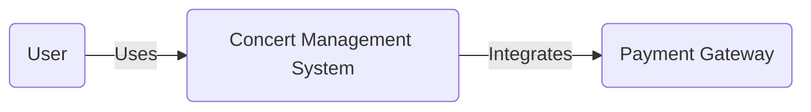
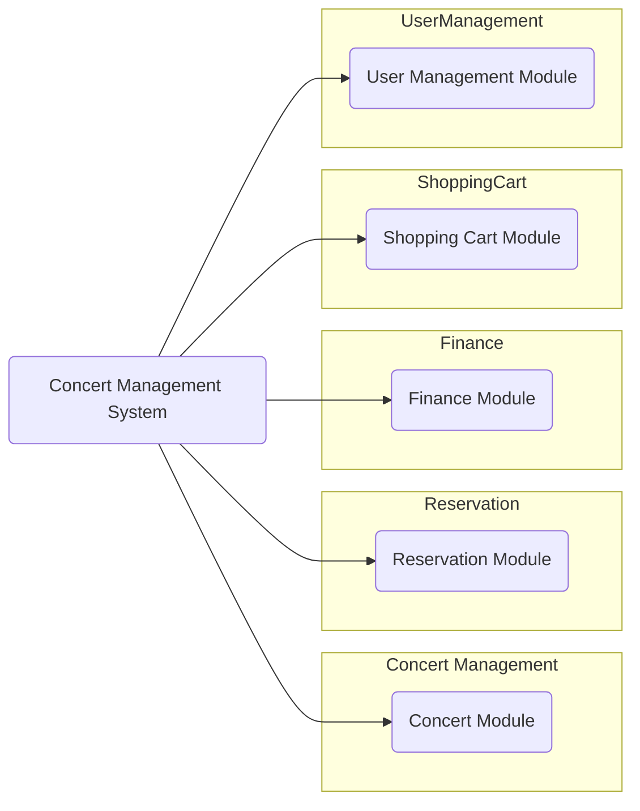
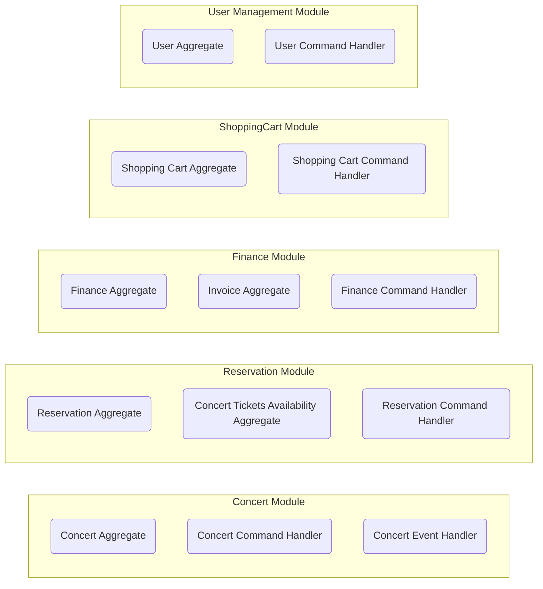

# Event Sourcing on Production Workshop

## Overview

Imagine you're organizing a Beyonce concert in Warsaw, and you need a system to manage every aspect of the event, from ticket reservations to financial transactions. Our system has you covered with the following modules:

### [Concert Management](#concert-management-module):
    
This module takes care of all the behind-the-scenes work that goes into planning the concert. As the organizer, you can create the concert event, set the location (Warsaw), date, and time, and even decide on the different types of tickets available (such as Regular and Golden Circle). You'll also have the power to update or cancel the concert and manage ticket pricing.

### [Shopping Cart](#shopping-cart-module):
In this module, users can collect tickets from multiple concerts in a single shopping cart. Once they're ready to checkout, they can confirm their selection and proceed with the payment. If any issues arise, like a failed payment, the system will handle the necessary compensation process.

### [Reservation](#reservation-module):

Once you have the concert details sorted, fans can start reserving their tickets through this module. They'll be able to choose from the different ticket types you've set up, and the system will make sure there aren't more reservations than available spots.

### [Order Management](#order-management-module):
This module coordinates the whole process of placing an order, including creating orders based on confirmed shopping carts, tracking the order status, and managing any changes or cancellations. It also ensures that the order details, such as ticket reservations and delivery methods, are properly handled.

### [Financial Management](#financial-management-module):

This module oversees invoicing, tracking user payments, and handling refunds. As the organizer, you'll have a clear view of the financial aspects of the event.

### [Ticket Management and Delivery](#ticket-management-module):

In this module, the system creates and manages tickets based on user reservations. It takes care of delivering the tickets to users via email or, if they prefer, arranging for printed tickets to be sent through courier services like FedEx.

### [User Management Module](#user-management-module):

This module handles user registration, authentication, and role management. It enables users to create an account, log in, and perform actions based on their assigned roles, such as regular user, administrator, or concert organizer.

In the case of a Beyonce concert in Warsaw, the system would allow the event organizer to create the concert, set ticket levels and pricing, and manage any updates. Users interested in attending the concert could reserve their tickets, add them to their shopping cart, and complete the payment process. The system would ensure that no more tickets are reserved than available spots and would handle the financial aspects of the transaction, including invoicing and payment processing. Users would then receive their tickets through their chosen delivery method.

## Architecture

Our system is built using a microservices architecture with event-driven design and event sourcing, ensuring scalability and resilience. We have implemented various bounded contexts, such as Concert Management, Reservation, Shopping Cart, Financial Management, and Ticket Management, to segregate the responsibilities and functionalities.

We use C# 11 and Marten as the underlying technology stack for the implementation of commands, events, and aggregates. Marten's support for event sourcing and document storage simplifies the development and maintenance of our system.

Each bounded context consists of aggregates, commands, events, and event handlers. We follow the Command-Query Responsibility Segregation (CQRS) pattern, separating read and write operations. The system relies on integration events to communicate between bounded contexts, allowing for a decoupled architecture.

To send emails, such as ticket delivery, we have integrated the system with Mailgun, an email service provider that offers a powerful API and idempotency support. This ensures that users receive their tickets reliably and securely.

Overall, the architecture is designed to be modular, maintainable, and efficient in handling the various aspects of concert management, ticket reservations, and sales.

The main components of the system's architecture are:

**1. Bounded Contexts:** The system is divided into multiple bounded contexts, each encapsulating a specific domain within the concert management system. These include the Concert Management, Reservation, ShoppingCart, Finance, and User Management modules. Bounded contexts promote separation of concerns and reduce coupling between different parts of the system.

**2. Aggregates:** Within each bounded context, aggregates are responsible for enforcing the domain invariants and maintaining the consistency of the business rules. Aggregates are event-sourced, meaning that their state is derived from a sequence of events. This approach provides strong consistency guarantees, auditability, and the ability to rebuild the state of the system at any point in time.

**3. Commands and Events:** Commands represent actions that can be performed in the system and are processed by command handlers. Events represent the results of these actions and are emitted by aggregates. Command handlers update the state of aggregates and emit events, while event handlers react to events and perform side effects, such as updating other aggregates, sending notifications, or integrating with external systems.

**4. Event Store:** The system uses an event store to persist and manage the events generated by aggregates. The event store acts as a source of truth for the system's state and enables event sourcing. In our system, we're using Marten as the event store, which provides a robust and scalable solution for storing and querying events.

**5. External Integrations:** The system integrates with external services, such as payment gateways (e.g., Stripe) to process payments and handle other related functionalities. This integration is done through event-driven communication, which allows for a loosely coupled connection between the system and the external services.

**6. CQRS (Command Query Responsibility Segregation):** The system follows the CQRS pattern, which separates the read and write operations of the system. This allows for better scalability, as the read and write loads can be optimized and scaled independently.

In summary, the Concert Management System's architecture is modular, event-driven, and event-sourced. It is composed of multiple bounded contexts that encapsulate specific domains, aggregates that enforce business rules and invariants, and an event store that manages the system's state. The system also integrates with external services and follows the CQRS pattern for improved scalability.

## C4 model

### System



### Container



### Component




## Bounded Contexts, Aggregates, Commands, and Events

<a href='#concert-management-module' id='concert-management-module' class='anchor' aria-hidden='true'></a>

### 1. Concert Management Module

#### Summary

- **Aggregates:** `Concert`
- **Commands:** `CreateConcert`, `UpdateConcert`, `CancelConcert`, `UpdateTicketLevels`
- **Events:** `ConcertCreated`, `ConcertUpdated`, `ConcertCancelled`, `TicketLevelsUpdated`

#### Flow

1. When a concert is created, the CreateConcert command is sent. The command handler creates a new Concert aggregate, initializes it with the artist, ticket levels, and pricing, and applies the ConcertCreated event.
2. When ticket levels and pricing are updated for a concert, the UpdateTicketLevels command is sent. The command handler loads the Concert aggregate, updates the ticket levels and pricing, and applies the TicketLevelsUpdated event.
3. When a concert is canceled, the CancelConcert command is sent. The command handler loads the Concert aggregate and cancels the concert by applying the `ConcertCancelled` event.

#### Concert

**1. Business Rules**    
- A concert can be created with a specified artist, ticket levels, and pricing.
- Ticket levels and pricing can be updated for an existing concert, as long as the concert is not canceled.
- A concert can be canceled if it is not already canceled.

**2. Invariants**
- The concert cannot be created without an artist, ticket levels, and pricing.
- The concert's ticket levels and pricing cannot be updated if the concert is canceled.
- The concert cannot be canceled if it is already canceled.

**3. Commands**

```csharp
public record CreateConcert(string ConcertId, string Artist, Dictionary<string, int> TicketLevels, Dictionary<string, decimal> Pricing);
public record UpdateTicketLevels(string ConcertId, Dictionary<string, int> TicketLevels, Dictionary<string, decimal> Pricing);
```

**3. Events**

```csharp
public record ConcertCreated(string ConcertId, string Artist, Dictionary<string, int> TicketLevels, Dictionary<string, decimal> Pricing);
public record TicketLevelsUpdated(string ConcertId, Dictionary<string, int> TicketLevels, Dictionary<string, decimal> Pricing);
```

**4. Aggregate**

```csharp
public class Concert
{
    public string ConcertId { get; private set; }
    public string Artist { get; private set; }
    public bool IsCancelled { get; private set; }
    public Dictionary<string, int> TicketLevels { get; private set; }
    public Dictionary<string, decimal> Pricing { get; private set; }

    private void Apply(ConcertCreated e)
    {
        ConcertId = e.ConcertId;
        Artist = e.Artist;
        TicketLevels = e.TicketLevels;
        Pricing = e.Pricing;
    }

    private void Apply(TicketLevelsUpdated e)
    {
        TicketLevels = e.TicketLevels;
        Pricing = e.Pricing;
    }

    private void Apply(ConcertCancelled e)
    {
        IsCancelled = true;
    }

    public void Create(CreateConcert command)
    {
        Apply(new ConcertCreated(command.ConcertId, command.Artist, command.TicketLevels, command.Pricing));
    }

    public void UpdateTicketLevels(UpdateTicketLevels command)
    {
        if (IsCancelled)
        {
            throw new InvalidOperationException("Cannot update ticket levels for a cancelled concert.");
        }

        Apply(new TicketLevelsUpdated(command.ConcertId, command.TicketLevels, command.Pricing));
    }

    public void Cancel(CancelConcert command)
    {
        if (IsCancelled)
        {
            throw new InvalidOperationException("Cannot cancel an already cancelled concert.");
        }

        Apply(new ConcertCancelled(command.ConcertId));
    }
}

```

**5. Command Handler**

```csharp
public class ConcertCommandHandler
{
    private readonly IDocumentSession _session;

    public ConcertCommandHandler(IDocumentSession session)
    {
        _session = session;
    }

    public async Task HandleAsync(CreateConcert command)
    {
        var concert = new Concert();
        concert.Create(command);

        _session.Events.Append(command.ConcertId, concert);
        await _session.SaveChangesAsync();
    }

    public async Task HandleAsync(UpdateTicketLevels command)
    {
        var concert = await _session.Events.AggregateStreamAsync<Concert>(command.ConcertId);
        concert.UpdateTicketLevels(command);

        _session.Events.Append(command.ConcertId, concert);
        await _session.SaveChangesAsync();
    }

    public async Task HandleAsync(CancelConcert command)
    {
        var concert = await _session.Events.AggregateStreamAsync<Concert>(command.ConcertId);
        concert.Cancel(command);

        _session.Events.Append(command.ConcertId, concert);
        await _session.SaveChangesAsync();
    }
}
```

<a href='#shopping-cart-module' id='shopping-cart-module' class='anchor' aria-hidden='true'></a>

### 2. Shopping Cart Module

#### Summary

- **Aggregates:** `ShoppingCart`
- **Commands:** `CreateCart`, `AddTicketToCart`, `RemoveTicketFromCart`, `ClearCart`, `ConfirmCart`
- **Events:** `CartCreated`, `TicketAddedToCart`, `TicketRemovedFromCart`, `CartCleared`, `CartConfirmed`

#### Flow

1. A user adds a ticket to the cart for the first time, which opens the shopping cart.
2. The user can add more tickets to the cart from different concerts and ticket levels.
3. The user can update the quantity of a ticket level in the cart.
4. The user can remove tickets from the cart.
5. The user can confirm their shopping cart, triggering the reservation of tickets and the payment process.
6. The user can cancel their shopping cart, clearing the cart and allowing for a new selection.

#### Shopping Cart

**1. Business Rules**    
- A user can have only one active shopping cart. The cart's ID is the same as the user's ID.
- A user can add tickets to the cart from different concerts and ticket levels.
- A user cannot add the same ticket level from the same concert to the cart more than once. They should update the quantity instead.
- A user can update the quantity of a ticket level for a specific concert in the cart.
- A user can remove tickets from the cart.
- A user can confirm their shopping cart, which will proceed to reserve the tickets and initiate the payment process. Once the cart is confirmed, the cart's state becomes empty again, and the user can start a new shopping cart.
- A user can cancel their shopping cart, which will clear the cart and make it available for a new selection.

**2. Invariants**
- The shopping cart must be open (not confirmed or canceled) to add, remove or update items.
- The quantity of tickets in the cart must be greater than zero and not exceed the available tickets for a specific concert and ticket level.
- A user can only have one active shopping cart. After confirming or canceling the cart, the cart's state becomes empty, and the user can start a new shopping cart.

**3. Commands**

```csharp
public record AddItemToCart(string UserId, string ConcertId, string TicketLevelId, int Quantity);
public record RemoveItemFromCart(string UserId, string ConcertId, string TicketLevelId);
public record UpdateItemQuantityInCart(string UserId, string ConcertId, string TicketLevelId, int NewQuantity);
public record ConfirmShoppingCart(string UserId);
public record CancelShoppingCart(string UserId);
```

**3. Events**

```csharp
public record ShoppingCartCreated(string UserId);
public record ShoppingCartItemAdded(string ShoppingCartId, string ConcertId, string TicketLevelId, int Quantity);
public record ShoppingCartItemUpdated(string ShoppingCartId, string ConcertId, string TicketLevelId, int NewQuantity);
public record ShoppingCartItemRemoved(string ShoppingCartId, string ConcertId, string TicketLevelId);
public record ShoppingCartConfirmed(string ShoppingCartId, string UserId, List<ReservedTicket> ReservedTickets, DeliveryMethod DeliveryMethod);
public record ShoppingCartCancelled(string ShoppingCartId);
```

**5. Aggregate**

```csharp
public class ShoppingCart
{
    public string Id { get; private set; }
    public Dictionary<string, CartItem> Items { get; private set; } = new();
    public bool IsOpened { get; private set; }
    public DeliveryMethod? DeliveryMethod { get; private set; }

    public ShoppingCart() { }

    private void EnsureOpened()
    {
        if (!IsOpened)
        {
            throw new InvalidOperationException("Shopping cart is not open.");
        }
    }

    public void AddItem(string userId, string concertId, string ticketLevelId, int quantity)
    {
        if (!IsOpened)
        {
            Apply(new ShoppingCartCreated(userId));
        }

        var key = $"{concertId}-{ticketLevelId}";
        if (!Items.ContainsKey(key))
        {
            Apply(new ShoppingCartItemAdded(Id, concertId, ticketLevelId, quantity));
            return;
        }

        Apply(new ShoppingCartItemUpdated(Id, concertId, ticketLevelId, Items[key].Quantity + quantity));
    }

    public void RemoveItem(string concertId, string ticketLevelId)
    {
        EnsureOpened();

        var key = $"{concertId}-{ticketLevelId}";
        if (!Items.ContainsKey(key)) return;

        Items.Remove(key);
        Apply(new ShoppingCartItemRemoved(Id, concertId, ticketLevelId));
    }

    public void UpdateItemQuantity(string concertId, string ticketLevelId, int newQuantity)
    {
        EnsureOpened();

        var key = $"{concertId}-{ticketLevelId}";
        if (!Items.ContainsKey(key)) return;

        Items[key].Quantity = newQuantity;
        Apply(new ShoppingCartItemUpdated(Id, concertId, ticketLevelId, newQuantity));
    }

    public void Confirm()
    {
        EnsureOpened();
        if (!Items.Any())
        {
            throw new InvalidOperationException("Cannot confirm an empty shopping cart");
        }

        Apply(new ShoppingCartConfirmed(Id));
    }

    public void Cancel()
    {
        EnsureOpened();
        Apply(new ShoppingCartCancelled(Id));
    }

    public void SetDeliveryMethod(DeliveryMethod deliveryMethod)
    {
        if (DeliveryMethod != null) throw new InvalidOperationException("Delivery method has already been set");

        Apply(new DeliveryMethodSet(Id, UserId, deliveryMethod));
    }

    private void Apply(DeliveryMethodSet e)
    {
        DeliveryMethod = e.DeliveryMethod;
    }

    private void Apply(ShoppingCartCreated @event)
    {
        Id = @event.UserId;
        IsOpened = true;
    }

    private void Apply(ShoppingCartItemAdded @event)
    {
        var key = $"{@event.ConcertId}-{@event.TicketLevelId}";
        var item = new CartItem(@event.ConcertId, @event.TicketLevelId, @event.Quantity);
        Items.Add(key, item);
    }

    private void Apply(ShoppingCartItemUpdated @event)
    {
        var key = $"{@event.ConcertId}-{@event.TicketLevelId}";
        Items[key].Quantity = @event.NewQuantity;
    }

    private void Apply(ShoppingCartItemRemoved @event)
    {
        var key = $"{@event.ConcertId}-{@event.TicketLevelId}";
        Items.Remove(key);
    }

    private void Apply(ShoppingCartConfirmed @event)
    {
        Items.Clear();
        IsOpened = false;
    }

    private void Apply(ShoppingCartCancelled @event)
    {
        Items.Clear();
        IsOpened = false;
    }
}
```

**6. Command Handler**

```csharp
public class ShoppingCartCommandHandler
{
    private readonly IDocumentSession _session;

    public ShoppingCartCommandHandler(IDocumentSession session)
    {
        _session = session;
    }

    public async Task HandleAsync(AddItemToCart command)
    {
        var shoppingCart = await _session.Events.AggregateStreamAsync<ShoppingCart>(command.UserId);
        shoppingCart.AddItem(command.UserId, command.ConcertId, command.TicketLevelId, command.Quantity);
        await _session.Events.AppendAsync(command.UserId, shoppingCart);
        await _session.SaveChangesAsync();
    }

    public async Task HandleAsync(RemoveItemFromCart command)
    {
        var shoppingCart = await _session.Events.AggregateStreamAsync<ShoppingCart>(command.UserId);
        shoppingCart.RemoveItem(command.ConcertId, command.TicketLevelId);
        await _session.Events.AppendAsync(command.UserId, shoppingCart);
        await _session.SaveChangesAsync();
    }

    public async Task HandleAsync(UpdateItemQuantityInCart command)
    {
        var shoppingCart = await _session.Events.AggregateStreamAsync<ShoppingCart>(command.UserId);
        shoppingCart.UpdateItemQuantity(command.ConcertId, command.TicketLevelId, command.NewQuantity);
        await _session.Events.AppendAsync(command.UserId, shoppingCart);
        await _session.SaveChangesAsync();
    }

    public async Task HandleAsync(ConfirmShoppingCart command)
    {
        var shoppingCart = await _session.Events.AggregateStreamAsync<ShoppingCart>(command.UserId);
        shoppingCart.Confirm();
        await _session.Events.AppendAsync(command.UserId, shoppingCart);
        await _session.SaveChangesAsync();
    }

    public async Task HandleAsync(CancelShoppingCart command)
    {
        var shoppingCart = await _session.Events.AggregateStreamAsync<ShoppingCart>(command.UserId);
        shoppingCart.Cancel();
        await _session.Events.AppendAsync(command.UserId, shoppingCart);
        await _session.SaveChangesAsync();
    }
}

```

<a href='#reservation-module' id='reservation-module' class='anchor' aria-hidden='true'></a>

### 3. Reservation Module

#### Summary

- **Aggregates:** `Reservation`, `ConcertTicketsAvailability`
- **Commands:** `CreateReservation`, `CancelReservation`, `ExpireReservation`
- **Events:** `ReservationCreated`, `ReservationCancelled`, `ReservationExpired`

#### Flow

1. When a concert is created, the `ConcertCreated` event is raised. The `ConcertEventHandler` listens to this event, creates a `ConcertTicketsAvailability` aggregate, and initializes it with the available tickets for each level.
2. When ticket levels are updated for a concert, the `TicketLevelsUpdated` event is raised. The `ConcertEventHandler` listens to this event, loads the `ConcertTicketsAvailability` aggregate, and updates the available tickets accordingly.
3. When a concert is canceled, the `ConcertCancelled` event is raised. The `ConcertEventHandler` listens to this event, loads the `ConcertTicketsAvailability` aggregate, and updates the available tickets to zero.
4. When the user confirms their cart, the system the `ReserveTickets` command is sent for each concert in the cart. The reservation command handler checks if there are enough available tickets for each level in the `ConcertTicketsAvailability` aggregate, updates the available tickets accordingly, and creates a new `Reservation` aggregate.
5. The reservation can be canceled or expired according to the business rules and invariants mentioned above. The `Reservation` aggregate is updated accordingly.

- **Business rules:**
  - Ensure tickets are available before creating a reservation.
- **Invariants:**
  - The total number of reserved tickets cannot exceed the concert's capacity for each ticket level.
  

#### Reservation

**1. Business Rules**

- A reservation can be created by a logged-in user only.
- A reservation can be canceled if it is not already canceled or expired.
- A reservation can expire if it is not already canceled or expired.

**2. Invariants:**

- The reservation cannot be created, canceled, or expired for a user that is not logged in.
- The reservation cannot be created for an unavailable concert.
- The reservation cannot be created if the number of requested tickets for each level exceeds the available tickets.

**3. Commands** 

```csharp
public record CreateReservation(string ReservationId, string ConcertId, Dictionary<string, int> TicketLevels, string UserId);
public record CancelReservation(string ReservationId);
public record ExpireReservation(string ReservationId);
````

**4. Events:**

```csharp
public record ReservationCreated(string ReservationId, string ConcertId, Dictionary<string, int> TicketLevels, string UserId);
public record ReservationCancelled(string ReservationId);
public record ReservationExpired(string ReservationId);
```

**5. Aggregate**

```csharp
public class Reservation
{
    public string ReservationId { get; private set; }
    public string ConcertId { get; private set; }
    public Dictionary<string, int> TicketLevels { get; private set; }
    public string UserId { get; private set; }
    public bool IsCancelled { get; private set; }
    public bool IsExpired { get; private set; }

    private void Apply(ReservationCreated e)
    {
        ReservationId = e.ReservationId;
        ConcertId = e.ConcertId;
        TicketLevels = e.TicketLevels;
        UserId = e.UserId;
    }

    private void Apply(ReservationCancelled e)
    {
        IsCancelled = true;
    }

    private void Apply(ReservationExpired e)
    {
        IsExpired = true;
    }

    public void Create(CreateReservation command)
    {
        if (string.IsNullOrWhiteSpace(command.UserId))
        {
            throw new InvalidOperationException("User must be authenticated to create a reservation.");
        }

        Apply(new ReservationCreated(command.ReservationId, command.ConcertId, command.TicketLevels, command.UserId));
    }

    public void Cancel(CancelReservation command)
    {
        if (IsCancelled || IsExpired)
        {
            throw new InvalidOperationException("Cannot cancel an already cancelled or expired reservation.");
        }

        Apply(new ReservationCancelled(command.ReservationId));
    }

    public void Expire(ExpireReservation command)
    {
        if (IsCancelled || IsExpired)
        {
            throw new InvalidOperationException("Cannot expire an already cancelled or expired reservation.");
        }

        Apply(new ReservationExpired(command.ReservationId));
    }
}
```

**6. Command Handler**

```csharp
public class ReservationCommandHandler
{
    private readonly IDocumentSession _session;

    public ReservationCommandHandler(IDocumentSession session)
    {
        _session = session;
    }

    public async Task HandleAsync(CreateReservation command)
    {
        // Load the concert aggregate and reserve tickets.
        var concert = await _session.Events.AggregateStreamAsync<Concert>(command.ConcertId);
        concert.ReserveTickets(new ReserveTickets(command.ConcertId, command.TicketLevels));

        // Create the reservation.
        var reservation = new Reservation();
        reservation.Create(command);

        // Append events to both aggregates.
        _session.Events.Append(command.ConcertId, concert);
        _session.Events.Append(command.ReservationId, reservation);

        // Save the changes in the same transaction.
        await _session.SaveChangesAsync();
    }

    public async Task HandleAsync(CancelReservation command)
    {
        var reservation = await _session.Events.AggregateStreamAsync<Reservation>(command.ReservationId);
        reservation.Cancel(command);
        _session.Events.Append(command.ReservationId, reservation);
        await _session.SaveChangesAsync();
    }

    public async Task HandleAsync(ExpireReservation command)
    {
        var reservation = await _session.Events.AggregateStreamAsync<Reservation>(command.ReservationId);
        reservation.Expire(command);
        _session.Events.Append(command.ReservationId, reservation);
        await _session.SaveChangesAsync();
    }
}
```

#### Concert Availability

**1. Business Rules**

- The concert tickets availability is created when a ConcertCreated event occurs.
- The concert tickets availability is updated when a TicketLevelsUpdated event occurs.
- The concert tickets availability is updated when a ConcertCancelled event occurs.
- Tickets can be reserved if there are enough available tickets for the requested ticket levels.

**2. Invariants:**

- The number of available tickets for each level should be non-negative.
- Tickets cannot be reserved if the number of requested tickets for each level exceeds the available tickets.

**3. Commands** 

None. Just using events from the concert module.

**4. Events:**

None. Just using events from the concert module and reservation aggregate.

**5. Aggregate**

```csharp
public class ConcertTicketsAvailability
{
    public string ConcertId { get; private set; }
    public Dictionary<string, int> AvailableTickets { get; private set; }

    public ConcertTicketsAvailability()
    {
    }

    private void Apply(ConcertCreated e)
    {
        ConcertId = e.ConcertId;
        AvailableTickets = e.TicketLevels;
    }

    private void Apply(TicketLevelsUpdated e)
    {
        AvailableTickets = e.TicketLevels;
    }

    private void Apply(ConcertCancelled e)
    {
        AvailableTickets = new Dictionary<string, int>();
    }

    public void ReserveTickets(ReserveTickets command)
    {
        foreach (var ticketLevel in command.TicketLevels)
        {
            if (!AvailableTickets.ContainsKey(ticketLevel.Key) || AvailableTickets[ticketLevel.Key] < ticketLevel.Value)
            {
                throw new InvalidOperationException("Not enough available tickets for the requested ticket level.");
            }

            AvailableTickets[ticketLevel.Key] -= ticketLevel.Value;
        }
    }
}

```

**6. Command Handler**

None.

**7. Event Handler**

```csharp
public class ConcertEventHandler
{
    private readonly IDocumentSession _session;

    public ConcertEventHandler(IDocumentSession session)
    {
        _session = session;
    }

    public async Task HandleAsync(ConcertCreated e)
    {
        var concertTicketsAvailability = new ConcertTicketsAvailability();
        concertTicketsAvailability.Apply(e);
        _session.Events.Append(e.ConcertId, concertTicketsAvailability);
        await _session.SaveChangesAsync();
    }

    public async Task HandleAsync(TicketLevelsUpdated e)
    {
        var concertTicketsAvailability = await _session.Events.AggregateStreamAsync<ConcertTicketsAvailability>(e.ConcertId);
        concertTicketsAvailability.Apply(e);
        _session.Events.Append(e.ConcertId, concertTicketsAvailability);
        await _session.SaveChangesAsync();
    }

    public async Task HandleAsync(ConcertCancelled e)
    {
        var concertTicketsAvailability = await _session.Events.AggregateStreamAsync<ConcertTicketsAvailability>(e.ConcertId);
        concertTicketsAvailability.Apply(e);
        _session.Events.Append(e.ConcertId, concertTicketsAvailability);
        await _session.SaveChangesAsync();
    }
}
```

<a href='#order-management-module' id='orders-module' class='anchor' aria-hidden='true'></a>


### 4. Order Management Module

#### Summary

- **Aggregates:** `TicketOrder`
- **Commands:** `CreateOrder`, `CompleteOrder`, `CancelOrder`, `CompensateOrder`
- **Events:** `OrderCreated`, `OrderCompleted`, `OrderCancelled`

#### Flow

The Order represents a confirmed purchase made by a user. It is created when the user confirms their ShoppingCart, and it serves as a bridge between the ShoppingCart, Reservations, Tickets, Payment, and Invoice. Here's how the Order is related to these entities:

**1. ShoppingCart:** When the user confirms their ShoppingCart, the system creates an Order with the details from the ShoppingCart. The Order holds information about the selected concerts, ticket levels, and quantities.

**2. Reservations:** After the Order is created, the system reserves the tickets for each concert in the Order. Each reservation is associated with the Order.

**3. Tickets:** Once the reservations are confirmed, the system generates tickets for the Order. These tickets include details such as the concert, ticket level, and user information.

**4. Payment:** When the Order is created, the system initiates the payment process. The Payment is linked to the Order, and the payment status is updated based on the success or failure of the payment transaction.

**5. Invoice:** After the payment is successful, the system generates an Invoice for the Order. The Invoice includes details of the ticket purchases, such as the concert, ticket levels, quantities, and the total amount.

The relationships between the Order and other entities ensure a smooth flow of information and actions throughout the ticket purchasing process. The Order serves as a central point connecting the ShoppingCart, Reservations, Tickets, Payment, and Invoice, providing a comprehensive view of the user's purchase.

#### Order

**1. Business Rules**

1. When a user confirms their ShoppingCart, an event (e.g., `ShoppingCartConfirmed`) is emitted. This event should contain the necessary data to create an Order, such as the user's ID, shopping cart ID, and selected items.

2. An event handler within the Order bounded context listens for the `ShoppingCartConfirmed` event. When this event is received, the handler creates a new Order using the `CreateOrder` command, which in turn emits the `OrderCreated` event.

3. The Reservation bounded context listens for the `OrderCreated` event. When this event is received, the handler reserves tickets for each concert in the Order. The Reservations are associated with the Order, and their status is updated accordingly (e.g., `ReservationCreated` and `ReservationConfirmed` events).

4. The Financial bounded context also listens for the `OrderCreated` event. When this event is received, the handler initiates the payment process by creating a Payment related to the Order. The payment status is updated based on the success or failure of the payment transaction (e.g., `PaymentCreated`, `PaymentCompleted`, and `PaymentFailed` events).

5. If the payment is successful, the Financial bounded context generates an Invoice for the Order and emits an InvoiceCreated event.

6. Once the payment is successful and the reservations are confirmed, the Order bounded context can update the Order status to confirmed by handling the `ConfirmOrder` command, which emits the `OrderConfirmed` event. In case of any failure or cancellation, the `CancelOrder` command can be issued, emitting the `OrderCancelled` event.

7. If the payment fails, the Financial bounded context should emit a PaymentFailed event, which includes the Order ID and the reason for the failure. The Order bounded context listens for this event and handles it by issuing a CancelOrder command, which in turn emits the OrderCancelled event.

8.The Reservation bounded context should also listen for the OrderCancelled event. When this event is received, the handler cancels any Reservations associated with the Order by issuing CancelReservation commands, which emit ReservationCancelled events.

9. Similarly, if the reservation process fails (e.g., due to insufficient ticket availability), the Reservation bounded context should emit a ReservationFailed event, which includes the Order ID and the reason for the failure. The Order bounded context listens for this event and handles it by issuing a CancelOrder command, which emits the OrderCancelled event. This will trigger the cancellation of any other Reservations associated with the Order, as well as the reversal of the payment (if applicable).

**2. Invariants:**

1. An order can only be created with a valid user ID.
2. Reserved tickets can only be added to the order when the order is in a Pending state.
3. An order can only be confirmed when it is in a Pending state.
4. Payment success can only be processed when the order is in a Confirmed state.
5. Payment failure can only be processed when the order is in a Confirmed state.
6. An order can only be canceled when it is in a Pending or Confirmed state.
7. An order cannot be modified (adding reserved tickets, confirming, processing payments, or canceling) when it is in a Paid or Canceled state.

**3. Commands** 

```csharp
public record CreateOrder(string UserId, string ShoppingCartId, List<OrderItem> OrderItems);
public record ConfirmOrder(string OrderId);
public record CancelOrder(string OrderId);
public record CancelOrderDueToTimeout(string OrderId);
```

**4. Events:**

```csharp
public record OrderCreated(string OrderId, string UserId, string ShoppingCartId, List<OrderItem> OrderItems);
public record OrderConfirmed(string OrderId);
public record OrderCancelled(string OrderId);
public record OrderCancelledDueToTimeout(string OrderId);
```

**5. Aggregate**

```csharp
using System;
using System.Collections.Generic;
using System.Linq;
using Marten.Schema;

public record ReservedTicket(string ConcertId, string TicketLevel, int Quantity);

public enum OrderStatus { Pending, Confirmed, Paid, Cancelled }

public class Order
{
    [Identity]
    public string Id { get; private init; }
    public string UserId { get; private set; }
    public OrderStatus Status { get; private set; }
    public decimal TotalAmount { get; private set; }
    public IReadOnlyList<ReservedTicket> ReservedTickets { get; private set; } = new List<ReservedTicket>();
    public string? PaymentTransactionId { get; private set; }

    private Order() { } // For Marten

    public Order(string id, string userId)
    {
        Id = id;
        UserId = userId;
        Apply(new OrderCreated(id, userId));
    }

    public void AddReservedTickets(IEnumerable<ReservedTicket> reservedTickets)
    {
        if (Status != OrderStatus.Pending)
        {
            throw new InvalidOperationException("Reserved tickets can only be added when the order is in pending status.");
        }

        Apply(new ReservedTicketsAdded(Id, reservedTickets.ToList()));
    }

    public void ConfirmOrder()
    {
        if (Status != OrderStatus.Pending)
        {
            throw new InvalidOperationException("The order can only be confirmed when it is in pending status.");
        }

        Apply(new OrderConfirmed(Id));
    }

    public void ProcessPaymentSuccess(decimal amount, string transactionId)
    {
        if (Status != OrderStatus.Confirmed)
        {
            throw new InvalidOperationException("The payment can only be processed when the order is in confirmed status.");
        }

        Apply(new PaymentSucceeded(Id, amount, transactionId));
    }

    public void ProcessPaymentFailure(string transactionId)
    {
        if (Status != OrderStatus.Confirmed)
        {
            throw new InvalidOperationException("The payment failure can only be processed when the order is in confirmed status.");
        }

        Apply(new PaymentFailed(Id, transactionId));
    }

    public void CancelOrder()
    {
        if (Status != OrderStatus.Pending && Status != OrderStatus.Confirmed)
        {
            throw new InvalidOperationException("The order can only be cancelled when it is in pending or confirmed status.");
        }

        Apply(new OrderCancelled(Id));
    }

    public void CancelOrderDueToTimeout()
    {
        if (Status != OrderStatus.Pending)
        {
            throw new InvalidOperationException("The order can only be cancelled due to timeout when it is in pending status.");
        }

        Apply(new OrderCancelledDueToTimeout(Id));
    }

    private void Apply(OrderCancelled @event)
    {
        Status = OrderStatus.Cancelled;
    }

    private void Apply(OrderCancelledDueToTimeout @event)
    {
        Status = OrderStatus.Cancelled;
    }

    private void Apply(object @event)
    {
        switch (@event)
        {
            case ReservedTicketsAdded e:
                _reservedTickets.AddRange(e.ReservedTickets);
                break;

            case OrderConfirmed _:
                IsConfirmed = true;
                break;

            case PaymentSucceeded e:
                IsPaymentSucceeded = true;
                TransactionId = e.TransactionId;
                break;

            case PaymentFailed _:
                IsPaymentSucceeded = false;
                TransactionId = null;
                break;

            default:
                throw new InvalidOperationException($"Unknown event '{@event.GetType().Name}'");
        }
    }
}

public record ReservedTicket(string ConcertId, string TicketLevel, int Quantity, decimal Price);
public record ReservedTicketsAdded(string OrderId, List<ReservedTicket> ReservedTickets);
public record OrderConfirmed(string OrderId);
public record PaymentSucceeded(string OrderId, decimal Amount, string TransactionId);
public record PaymentFailed(string OrderId, decimal Amount, string Reason);
```

**6. Command Handler**

```csharp
public record AddReservedTicketsCommand(string OrderId, IEnumerable<ReservedTicket> ReservedTickets);
public record ConfirmOrderCommand(string OrderId);
public record ProcessPaymentSuccessCommand(string OrderId, decimal Amount, string TransactionId);
public record ProcessPaymentFailureCommand(string OrderId, decimal Amount, string Reason);

public class OrderCommandHandler
{
    private readonly IDocumentSession _session;

    public OrderCommandHandler(IDocumentSession session)
    {
        _session = session;
    }

    public async Task HandleAsync(AddReservedTicketsCommand command)
    {
        var order = await _session.LoadAsync<Order>(command.OrderId);
        order.AddReservedTickets(command.ReservedTickets);
        await _session.SaveChangesAsync();
    }

    public async Task HandleAsync(ConfirmOrderCommand command)
    {
        var order = await _session.LoadAsync<Order>(command.OrderId);
        order.ConfirmOrder();
        await _session.SaveChangesAsync();
    }

    public async Task HandleAsync(ProcessPaymentSuccessCommand command)
    {
        var order = await _session.LoadAsync<Order>(command.OrderId);
        order.ProcessPaymentSuccess(command.Amount, command.TransactionId);
        await _session.SaveChangesAsync();
    }

    public async Task HandleAsync(ProcessPaymentFailureCommand command)
    {
        var order = await _session.LoadAsync<Order>(command.OrderId);
        order.ProcessPaymentFailure(command.Amount, command.Reason);
        await _session.SaveChangesAsync();
    } 
    
    public async Task HandleAsync(CancelOrderCommand command)
    {
        var order = await _session.LoadAsync<Order>(command.OrderId);
        order.CancelOrder();
        await _session.SaveChangesAsync();
    }

    public async Task HandleAsync(CancelOrderDueToTimeoutCommand command)
    {
        var order = await _session.LoadAsync<Order>(command.OrderId);
        order.CancelOrderDueToTimeout();
        await _session.SaveChangesAsync();
    }
}

```

**7. Event Handlers**

Shopping Cart Events:

```csharp
using System.Threading;
using System.Threading.Tasks;
using Marten;
using MediatR;

public class ShoppingCartConfirmedHandler : INotificationHandler<ShoppingCartConfirmed>
{
    private readonly IDocumentSession _session;

    public ShoppingCartConfirmedHandler(IDocumentSession session)
    {
        _session = session;
    }

    public async Task Handle(ShoppingCartConfirmed notification, CancellationToken cancellationToken)
    {
        // Extract necessary data from the ShoppingCartConfirmed event
        var userId = notification.UserId;
        var shoppingCartId = notification.ShoppingCartId;
        var orderItems = new List<OrderItem>();

        foreach (var item in notification.Items)
        {
            var orderItem = new OrderItem
            {
                ConcertId = item.ConcertId,
                TicketLevelId = item.TicketLevelId,
                Quantity = item.Quantity
            };

            orderItems.Add(orderItem);
        }

        // Create the Order aggregate using the new CreateFromShoppingCart method
        var orderId = Guid.NewGuid().ToString();
        var order = Order.CreateFromShoppingCart(orderId, userId, shoppingCartId, orderItems);

        // Save the Order aggregate
        _session.Events.Append(orderId, order.PendingEvents.ToArray());
        await _session.SaveChangesAsync(cancellationToken);
    }
}
```

Reservation Events:

```csharp
using System.Threading;
using System.Threading.Tasks;
using Marten;
using MediatR;

public class ReservationConfirmedHandler
    : INotificationHandler<ReservationConfirmed>, INotificationHandler<ReservationFailed>
{
    private readonly IDocumentSession _session;

    public ReservationConfirmedHandler(IDocumentSession session)
    {
        _session = session;
    }

    public async Task Handle(ReservationConfirmed notification, CancellationToken cancellationToken)
    {
        // Extract necessary data from the ReservationConfirmed event
        var orderId = notification.OrderId;
        var reservationId = notification.ReservationId;
        var reservedTickets = notification.ReservedTickets;

        // Load the Order aggregate
        var order = await _session.Events.AggregateStreamAsync<Order>(orderId, cancellationToken);

        // Process the reservation confirmation
        order.ProcessReservationConfirmation(reservationId, reservedTickets);

        // Save the Order aggregate
        _session.Events.Append(orderId, order.PendingEvents.ToArray());
        await _session.SaveChangesAsync(cancellationToken);
    }
    
    public async Task Handle(ReservationFailed notification, CancellationToken cancellationToken)
    {
        // Extract necessary data from the ReservationFailed event
        var orderId = notification.OrderId;
        var reservationId = notification.ReservationId;
        var reason = notification.Reason;

        // Load the Order aggregate
        var order = await _session.Events.AggregateStreamAsync<Order>(orderId, cancellationToken);

        // Process the reservation failure
        order.ProcessReservationFailure(reservationId, reason);

        // Save the Order aggregate
        _session.Events.Append(orderId, order.PendingEvents.ToArray());
        await _session.SaveChangesAsync(cancellationToken);
    }
}
```

Payments Events:

```csharp
using System.Threading;
using System.Threading.Tasks;
using Marten;
using MediatR;

public class PaymentSucceededHandler
    : INotificationHandler<PaymentSucceeded>, INotificationHandler<PaymentFailed>
{
    private readonly IDocumentSession _session;

    public PaymentSucceededHandler(IDocumentSession session)
    {
        _session = session;
    }

    public async Task Handle(PaymentSucceeded notification, CancellationToken cancellationToken)
    {
        // Extract necessary data from the PaymentSucceeded event
        var orderId = notification.OrderId;
        var amount = notification.Amount;
        var transactionId = notification.TransactionId;

        // Load the Order aggregate
        var order = await _session.Events.AggregateStreamAsync<Order>(orderId, cancellationToken);

        // Process the payment success
        order.ProcessPaymentSuccess(amount, transactionId);

        // Save the Order aggregate
        _session.Events.Append(orderId, order.PendingEvents.ToArray());
        await _session.SaveChangesAsync(cancellationToken);
    }

    public async Task Handle(PaymentFailed notification, CancellationToken cancellationToken)
    {
        // Extract necessary data from the PaymentFailed event
        var orderId = notification.OrderId;
        var amount = notification.Amount;
        var reason = notification.Reason;

        // Load the Order aggregate
        var order = await _session.Events.AggregateStreamAsync<Order>(orderId, cancellationToken);

        // Process the payment failure
        order.ProcessPaymentFailure(amount, reason);

        // Save the Order aggregate
        _session.Events.Append(orderId, order.PendingEvents.ToArray());
        await _session.SaveChangesAsync(cancellationToken);
    }
}
```

<a href='#ticket-management-module' id='ticket-management-module' class='anchor' aria-hidden='true'></a>

### 5. Ticket Management And Delivery Module

#### Summary

- **Aggregates:** `Ticket`, `TicketDelivery`
- **Commands:** `PrepareTicketDelivery`, `DeliverOnlineTicket`, `DeliverPrintedTicket`, `ValidateTicket`
- **Events:** `TicketCreated`, `TicketDeliveryPrepared`, `OnlineTicketDelivered`, `PrintedTicketDelivered`, `TicketValidated`, `TicketValidationFailed`

#### Flow

When a reservation is confirmed in the Reservation module, it will emit a ReservationConfirmed event. The Ticket Management module will have an event handler that listens for this event. Upon receiving the event, it will trigger the CreateTicket command to create the tickets associated with that reservation.

Similarly, when an order is confirmed in the Order module, it will emit an OrderConfirmed event. The Ticket Management module will have an event handler that listens for this event and triggers the appropriate ticket delivery method (SendTicketByEmail or SendTicketByCourier) based on the delivery information provided in the event.

If an admin needs to manually trigger the sending of a ticket, instead of invoking a direct command, they can emit a custom event (e.g., AdminTicketSendRequested) which the Ticket Management module will listen to and trigger the appropriate ticket delivery method.

The Ticket Management module will integrate with an external email service like Mailgun to send email tickets. When the SendTicketByEmail command is executed, it will interact with the Mailgun API to send the ticket to the user's email address.
    
Similarly, the Ticket Management module will integrate with courier services to send printed tickets. When the SendTicketByCourier command is executed, it will interact with the courier service's API to initiate the shipping process and obtain tracking information.


#### Ticket

**1. Business Rules**

1. A ticket cannot be created if the reservation is not confirmed.
2. A ticket cannot be created if the total number of tickets reserved for the concert exceeds the available capacity.

**2. Invariants:**

1. A ticket must be associated with a valid concert and user.
2. The ticket type (e.g., Regular, Golden Circle) must be valid for the concert.
3. A ticket must have a unique identifier.

**3. Commands** 

```csharp
public record ValidateTicket(string TicketId, string ConcertId);
```

**4. Events:**

```csharp
public record TicketCreated(string TicketId, string ConcertId, string UserId, string TicketLevel, bool IsPrinted);
public record TicketValidated(string TicketId, string ConcertId);
public record TicketValidationFailed(string TicketId, string ConcertId, string Reason);
```

**5. Aggregate**


```csharp
public class Ticket
{
    public string Id { get; private set; }
    public string ConcertId { get; private set; }
    public string UserId { get; private set; }
    public string TicketLevel { get; private set; }
    public bool IsPrinted { get; private set; }
    public bool IsValidated { get; private set; }

    private Ticket() { }

    public Ticket(string id, string concertId, string userId, string ticketLevel, bool isPrinted)
    {
        Apply(new TicketCreated(id, concertId, userId, ticketLevel, isPrinted));
    }

    public void Validate(string concertId)
    {
        if (IsValidated)
        {
            Apply(new TicketValidationFailed(Id, concertId, "Ticket has already been validated."));
            return;
        }

        if (ConcertId != concertId)
        {
            Apply(new TicketValidationFailed(Id, concertId, "Ticket is not valid for this concert."));
            return;
        }

        Apply(new TicketValidated(Id, concertId));
    }

    // Apply methods
    private void Apply(TicketCreated e)
    {
        Id = e.TicketId;
        ConcertId = e.ConcertId;
        UserId = e.UserId;
        TicketLevel = e.TicketLevel;
        IsPrinted = e.IsPrinted;
        IsValidated = false;
    }

    private void Apply(TicketValidated e)
    {
        IsValidated = true;
    }

    private void Apply(TicketValidationFailed e)
    {
        // No state changes are required for a failed validation
    }
}
```

**6. Event Handler**

```csharp
public class TicketEventHandler
{
    private readonly IDocumentSession _session;

    public TicketEventHandler(IDocumentSession session)
    {
        _session = session;
    }

    public async Task HandleAsync(OrderCreated @event)
    {
        foreach (var reservation in @event.Reservations)
        {
            var ticket = Ticket.Create(reservation.UserId, reservation.ConcertId, reservation.TicketType, reservation.Quantity);

            await _session.Events.AppendAsync(ticket.Id, ticket.PendingEvents.ToArray());
        }

        await _session.SaveChangesAsync();
    }
}
```

#### Ticket Delivery

**1. Business Rules**

1. Ticket delivery must be initiated only after the order is confirmed and payment is successful.
2. A ticket can only be delivered once. If the delivery fails, the system must handle the necessary compensation or retry process.

**2. Invariants:**

1. A ticket delivery method must be chosen before the ticket is delivered. The possible methods are email and courier service (e.g., FedEx).
2. If the delivery method is email, the user's email address must be valid.
3. If the delivery method is courier service, the user's shipping address must be valid.


**3. Commands** 

```csharp
public record SendTicketByEmail(string TicketId, string Email);
public record ShipTicket(string TicketId, string CourierName, string TrackingNumber);
```

**4. Events:**

```csharp
public record TicketEmailSent(string TicketId, string Email);
public record TicketShipped(string TicketId, string CourierName, string TrackingNumber);
```

**5. Aggregate**

```csharp
public class TicketDelivery
{
    public string TicketId { get; private set; }
    public string Email { get; private set; }
    public string CourierName { get; private set; }
    public string TrackingNumber { get; private set; }

    private TicketDelivery() { }

    public TicketDelivery(string ticketId)
    {
        TicketId = ticketId;
    }

    public void SendByEmail(string email)
    {
        Apply(new TicketEmailSent(TicketId, email));
    }

    public void Ship(string courierName, string trackingNumber)
    {
        Apply(new TicketShipped(TicketId, courierName, trackingNumber));
    }

    // Apply methods
    private void Apply(TicketEmailSent e)
    {
        Email = e.Email;
    }

    private void Apply(TicketShipped e)
    {
        CourierName = e.CourierName;
        TrackingNumber = e.TrackingNumber;
    }
}
```

**6. Event Handler**

```csharp
public class TicketDeliveryEventHandler
{
    private readonly IDocumentSession _session;

    public TicketDeliveryEventHandler(IDocumentSession session)
    {
        _session = session;
    }

    public async Task Handle(OrderCreated e)
    {
        foreach (var ticket in e.Tickets)
        {
            for (int i = 0; i < ticket.Value; i++)
            {
                var ticketDelivery = new TicketDelivery($"{e.OrderId}-{ticket.Key}-{i}", e.DeliveryMethod);
                await _session.Events.Append(ticketDelivery.TicketId, ticketDelivery);
            }
        }
        await _session.SaveChangesAsync();
    }
}
```

### 6. Payment (Bounded Context: Payments)

- **Aggregates:** `Payment`
- **Commands:** : `InitiatePayment`, `ConfirmPayment`, `RefundPayment`
- **Events:** `PaymentInitiated`, `PaymentConfirmed`, `PaymentRefunded`

<a href='#user-management-module' id='user-management-module' class='anchor' aria-hidden='true'></a>

### 7. User Management Module

- **Aggregates:** `User`
- **Commands:** : `RegisterUser`, `UpdateUserRole`
- **Events:** `UserRegistered`, `UserRoleUpdated`

### 8. Finance (Bounded Context: Finance)

- **Aggregates:** `Invoice`, `UserFinancialInfo`
- **Commands:** `CreateInvoice`, `UpdateInvoice`, `CreateUserFinancialInfo`, `UpdateUserFinancialInfo`
- **Events:** `InvoiceCreated`, `InvoiceUpdated`, `UserFinancialInfoCreated`, `UserFinancialInfoUpdated`

### Flow

#### Payment

**1. Business Rules**

TODO

**2. Invariants:**

TODO

**3. Commands** 

```csharp
public record CreatePayment(string UserId, string OrderId, decimal PaymentAmount, string PaymentMethod);
public record CompletePayment(string PaymentId);
public record FailPayment(string PaymentId);
```

**4. Events:**

```csharp
public record PaymentCreated(string PaymentId, string UserId, string OrderId, decimal PaymentAmount, string PaymentMethod);
public record PaymentCompleted(string PaymentId);
public record PaymentFailed(string PaymentId);
```

**5. Aggregate**


#### Invoice

**1. Business Rules**

- TODO

**2. Invariants:**

- TODO

**3. Commands** 

```csharp
public record CreateInvoice(string UserId, string OrderId, InvoiceDetails InvoiceDetails);
```

**4. Events:**

```csharp
public record InvoiceCreated(string InvoiceId, string UserId, string OrderId, InvoiceDetails InvoiceDetails);
```

**5. Aggregate**

TODO