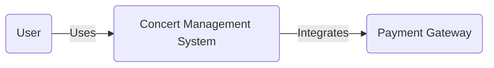
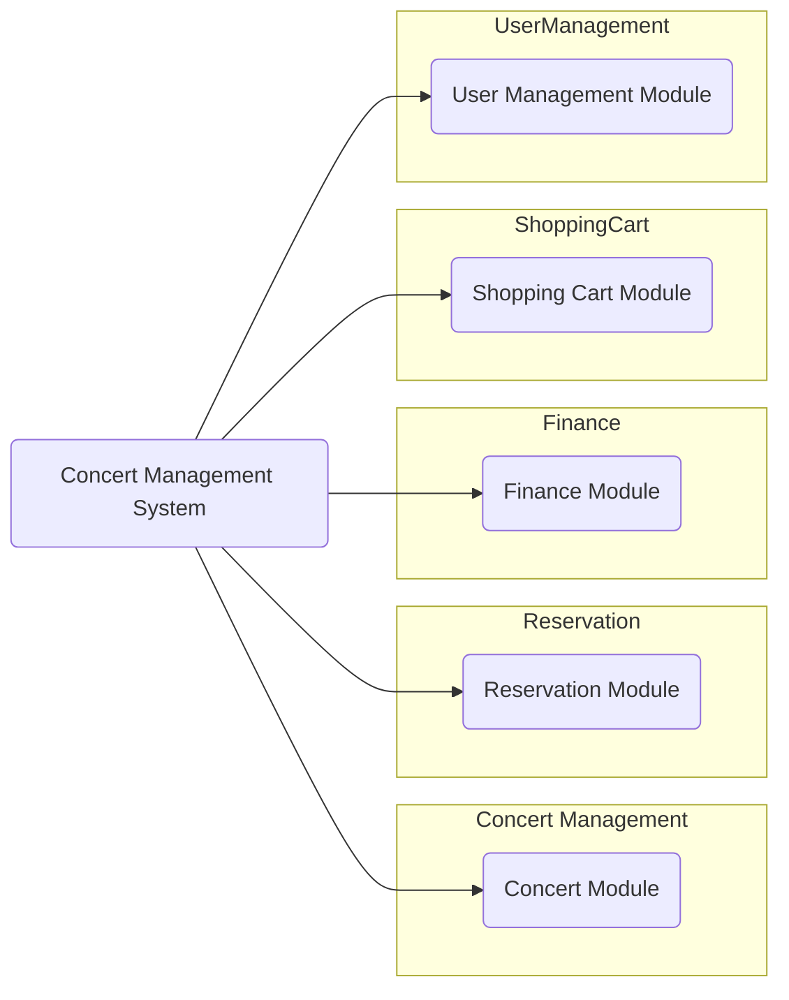
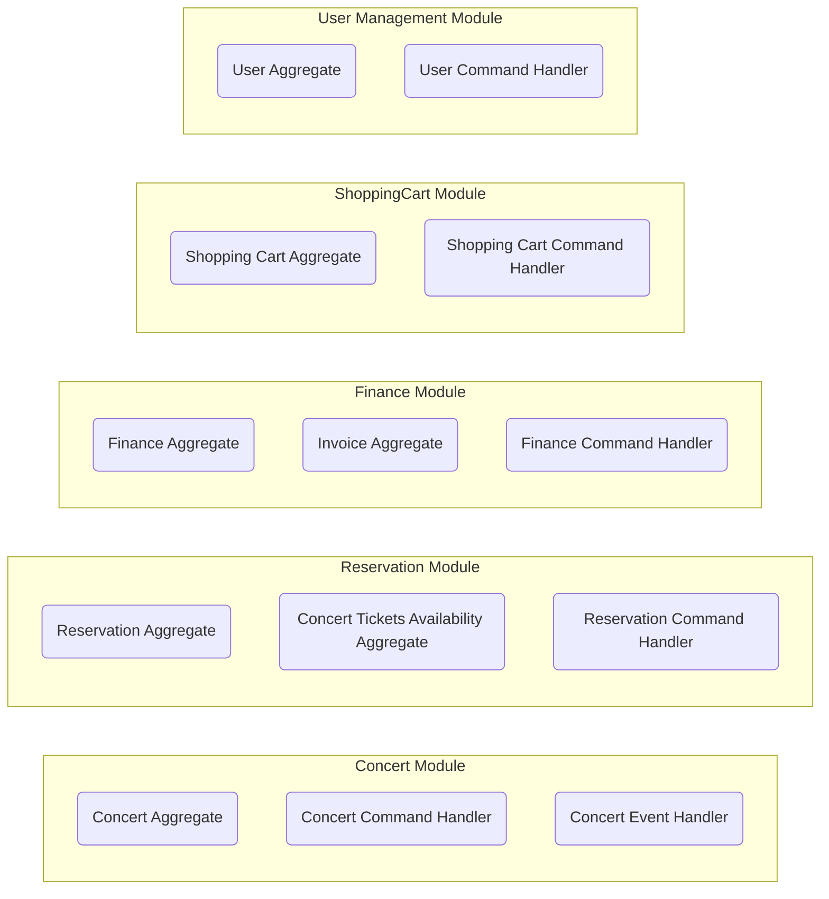

# Event Sourcing on Production Workshop

## Overview

Our system is a comprehensive Concert Management System designed to handle various aspects of organizing and managing concerts, such as concert creation, ticket reservations, payments, and user management. It is built with a modular architecture, allowing it to be easily expanded or modified to accommodate new requirements.

The system features multiple modules, including:

**1. Concert Management Module:** This module handles the creation and management of concerts, such as a Beyonce concert in Warsaw. It allows the event organizer to input details about the concert, like the artist performing, different ticket levels (e.g., regular, golden circle), and pricing for each ticket level.

**2. Reservation Module:** This module allows users to reserve tickets for concerts, ensuring that they can secure a spot for the event. It manages ticket reservations and makes sure that no more tickets are reserved than the available spots for each ticket level. Users can select the desired ticket level and the number of tickets they want to reserve.

**3. ShoppingCart Module:** This module enables users to add tickets from multiple concerts to a shopping cart, allowing them to purchase tickets for different events in a single transaction. Users can also select ticket delivery options, such as online or printed tickets, and choose their preferred delivery method (e.g., email or postal service).

**4. Finance Module:** This module manages the financial aspects of the system, including processing payments, generating invoices, and maintaining user financial information. It integrates with external payment gateways, like Stripe, to handle secure payment transactions.

**5. User Management Module:** This module manages user accounts, allowing them to register, log in, and access their account information. It differentiates users based on their roles, such as unauthenticated users, logged-in users, and administrators.

In the case of a Beyonce concert in Warsaw, the system would allow the event organizer to create the concert, set ticket levels and pricing, and manage any updates. Users interested in attending the concert could reserve their tickets, add them to their shopping cart, and complete the payment process. The system would ensure that no more tickets are reserved than available spots and would handle the financial aspects of the transaction, including invoicing and payment processing. Users would then receive their tickets through their chosen delivery method.

## Architecture

The architecture of our Concert Management System is designed with modularity, scalability, and maintainability in mind. It follows an event-driven and event-sourced approach, which ensures that the system can react to different events in a highly decoupled and extensible way. The main components of the system's architecture are:

**1. Bounded Contexts:** The system is divided into multiple bounded contexts, each encapsulating a specific domain within the concert management system. These include the Concert Management, Reservation, ShoppingCart, Finance, and User Management modules. Bounded contexts promote separation of concerns and reduce coupling between different parts of the system.

**2. Aggregates:** Within each bounded context, aggregates are responsible for enforcing the domain invariants and maintaining the consistency of the business rules. Aggregates are event-sourced, meaning that their state is derived from a sequence of events. This approach provides strong consistency guarantees, auditability, and the ability to rebuild the state of the system at any point in time.

**3. Commands and Events:** Commands represent actions that can be performed in the system and are processed by command handlers. Events represent the results of these actions and are emitted by aggregates. Command handlers update the state of aggregates and emit events, while event handlers react to events and perform side effects, such as updating other aggregates, sending notifications, or integrating with external systems.

**4. Event Store:** The system uses an event store to persist and manage the events generated by aggregates. The event store acts as a source of truth for the system's state and enables event sourcing. In our system, we're using Marten as the event store, which provides a robust and scalable solution for storing and querying events.

**5. External Integrations:** The system integrates with external services, such as payment gateways (e.g., Stripe) to process payments and handle other related functionalities. This integration is done through event-driven communication, which allows for a loosely coupled connection between the system and the external services.

**6. CQRS (Command Query Responsibility Segregation):** The system follows the CQRS pattern, which separates the read and write operations of the system. This allows for better scalability, as the read and write loads can be optimized and scaled independently.

In summary, the Concert Management System's architecture is modular, event-driven, and event-sourced. It is composed of multiple bounded contexts that encapsulate specific domains, aggregates that enforce business rules and invariants, and an event store that manages the system's state. The system also integrates with external services and follows the CQRS pattern for improved scalability.

## C4 model

### System



### Container



### Component




## Bounded Contexts, Aggregates, Commands, and Events

### 1. Concert Management (Bounded Context: `Concerts`)

#### Summary

- **Aggregates:** `Concert`
- **Commands:** `CreateConcert`, `UpdateConcert`, `CancelConcert`, `UpdateTicketLevels`
- **Events:** `ConcertCreated`, `ConcertUpdated`, `ConcertCancelled`, `TicketLevelsUpdated`

#### Flow

1. When a concert is created, the CreateConcert command is sent. The command handler creates a new Concert aggregate, initializes it with the artist, ticket levels, and pricing, and applies the ConcertCreated event.
2. When ticket levels and pricing are updated for a concert, the UpdateTicketLevels command is sent. The command handler loads the Concert aggregate, updates the ticket levels and pricing, and applies the TicketLevelsUpdated event.
3. When a concert is canceled, the CancelConcert command is sent. The command handler loads the Concert aggregate and cancels the concert by applying the `ConcertCancelled` event.

#### Concert

**1. Business Rules**    
- A concert can be created with a specified artist, ticket levels, and pricing.
- Ticket levels and pricing can be updated for an existing concert, as long as the concert is not canceled.
- A concert can be canceled if it is not already canceled.

**2. Invariants**
- The concert cannot be created without an artist, ticket levels, and pricing.
- The concert's ticket levels and pricing cannot be updated if the concert is canceled.
- The concert cannot be canceled if it is already canceled.

**3. Commands**

```csharp
public record CreateConcert(string ConcertId, string Artist, Dictionary<string, int> TicketLevels, Dictionary<string, decimal> Pricing);
public record UpdateTicketLevels(string ConcertId, Dictionary<string, int> TicketLevels, Dictionary<string, decimal> Pricing);
```

**3. Events**

```csharp
public record ConcertCreated(string ConcertId, string Artist, Dictionary<string, int> TicketLevels, Dictionary<string, decimal> Pricing);
public record TicketLevelsUpdated(string ConcertId, Dictionary<string, int> TicketLevels, Dictionary<string, decimal> Pricing);
```

**4. Aggregate**

```csharp
public class Concert
{
    public string ConcertId { get; private set; }
    public string Artist { get; private set; }
    public bool IsCancelled { get; private set; }
    public Dictionary<string, int> TicketLevels { get; private set; }
    public Dictionary<string, decimal> Pricing { get; private set; }

    private void Apply(ConcertCreated e)
    {
        ConcertId = e.ConcertId;
        Artist = e.Artist;
        TicketLevels = e.TicketLevels;
        Pricing = e.Pricing;
    }

    private void Apply(TicketLevelsUpdated e)
    {
        TicketLevels = e.TicketLevels;
        Pricing = e.Pricing;
    }

    private void Apply(ConcertCancelled e)
    {
        IsCancelled = true;
    }

    public void Create(CreateConcert command)
    {
        Apply(new ConcertCreated(command.ConcertId, command.Artist, command.TicketLevels, command.Pricing));
    }

    public void UpdateTicketLevels(UpdateTicketLevels command)
    {
        if (IsCancelled)
        {
            throw new InvalidOperationException("Cannot update ticket levels for a cancelled concert.");
        }

        Apply(new TicketLevelsUpdated(command.ConcertId, command.TicketLevels, command.Pricing));
    }

    public void Cancel(CancelConcert command)
    {
        if (IsCancelled)
        {
            throw new InvalidOperationException("Cannot cancel an already cancelled concert.");
        }

        Apply(new ConcertCancelled(command.ConcertId));
    }
}

```

**5. Command Handler**

```csharp
public class ConcertCommandHandler
{
    private readonly IDocumentSession _session;

    public ConcertCommandHandler(IDocumentSession session)
    {
        _session = session;
    }

    public async Task HandleAsync(CreateConcert command)
    {
        var concert = new Concert();
        concert.Create(command);

        _session.Events.Append(command.ConcertId, concert);
        await _session.SaveChangesAsync();
    }

    public async Task HandleAsync(UpdateTicketLevels command)
    {
        var concert = await _session.Events.AggregateStreamAsync<Concert>(command.ConcertId);
        concert.UpdateTicketLevels(command);

        _session.Events.Append(command.ConcertId, concert);
        await _session.SaveChangesAsync();
    }

    public async Task HandleAsync(CancelConcert command)
    {
        var concert = await _session.Events.AggregateStreamAsync<Concert>(command.ConcertId);
        concert.Cancel(command);

        _session.Events.Append(command.ConcertId, concert);
        await _session.SaveChangesAsync();
    }
}
```

### 2. Shopping Cart (Bounded Context: `ShoppingCarts`)

#### Summary

- **Aggregates:** `ShoppingCart`
- **Commands:** `CreateCart`, `AddTicketToCart`, `RemoveTicketFromCart`, `ClearCart`, `ConfirmCart`
- **Events:** `CartCreated`, `TicketAddedToCart`, `TicketRemovedFromCart`, `CartCleared`, `CartConfirmed`

#### Flow

1. A user adds a ticket to the cart for the first time, which opens the shopping cart.
2. The user can add more tickets to the cart from different concerts and ticket levels.
3. The user can update the quantity of a ticket level in the cart.
4. The user can remove tickets from the cart.
5. The user can confirm their shopping cart, triggering the reservation of tickets and the payment process.
6. The user can cancel their shopping cart, clearing the cart and allowing for a new selection.

#### Shopping Cart

**1. Business Rules**    
- A user can have only one active shopping cart. The cart's ID is the same as the user's ID.
- A user can add tickets to the cart from different concerts and ticket levels.
- A user cannot add the same ticket level from the same concert to the cart more than once. They should update the quantity instead.
- A user can update the quantity of a ticket level for a specific concert in the cart.
- A user can remove tickets from the cart.
- A user can confirm their shopping cart, which will proceed to reserve the tickets and initiate the payment process. Once the cart is confirmed, the cart's state becomes empty again, and the user can start a new shopping cart.
- A user can cancel their shopping cart, which will clear the cart and make it available for a new selection.

**2. Invariants**
- The shopping cart must be open (not confirmed or canceled) to add, remove or update items.
- The quantity of tickets in the cart must be greater than zero and not exceed the available tickets for a specific concert and ticket level.
- A user can only have one active shopping cart. After confirming or canceling the cart, the cart's state becomes empty, and the user can start a new shopping cart.

**3. Commands**

```csharp
public record AddItemToCart(string UserId, string ConcertId, string TicketLevelId, int Quantity);
public record RemoveItemFromCart(string UserId, string ConcertId, string TicketLevelId);
public record UpdateItemQuantityInCart(string UserId, string ConcertId, string TicketLevelId, int NewQuantity);
public record ConfirmShoppingCart(string UserId);
public record CancelShoppingCart(string UserId);
```

**3. Events**

```csharp
public record ShoppingCartCreated(string UserId);
public record ShoppingCartItemAdded(string ShoppingCartId, string ConcertId, string TicketLevelId, int Quantity);
public record ShoppingCartItemUpdated(string ShoppingCartId, string ConcertId, string TicketLevelId, int NewQuantity);
public record ShoppingCartItemRemoved(string ShoppingCartId, string ConcertId, string TicketLevelId);
public record ShoppingCartConfirmed(string ShoppingCartId);
public record ShoppingCartCancelled(string ShoppingCartId);
```

**5. Aggregate**

```csharp
public class ShoppingCart
{
    public string Id { get; private set; }
    public Dictionary<string, CartItem> Items { get; private set; } = new();
    public bool IsOpened { get; private set; }

    public ShoppingCart() { }

    private void EnsureOpened()
    {
        if (!IsOpened)
        {
            throw new InvalidOperationException("Shopping cart is not open.");
        }
    }

    public void AddItem(string userId, string concertId, string ticketLevelId, int quantity)
    {
        if (!IsOpened)
        {
            Apply(new ShoppingCartCreated(userId));
        }

        var key = $"{concertId}-{ticketLevelId}";
        if (!Items.ContainsKey(key))
        {
            Apply(new ShoppingCartItemAdded(Id, concertId, ticketLevelId, quantity));
            return;
        }

        Apply(new ShoppingCartItemUpdated(Id, concertId, ticketLevelId, Items[key].Quantity + quantity));
    }

    public void RemoveItem(string concertId, string ticketLevelId)
    {
        EnsureOpened();

        var key = $"{concertId}-{ticketLevelId}";
        if (!Items.ContainsKey(key)) return;

        Items.Remove(key);
        Apply(new ShoppingCartItemRemoved(Id, concertId, ticketLevelId));
    }

    public void UpdateItemQuantity(string concertId, string ticketLevelId, int newQuantity)
    {
        EnsureOpened();

        var key = $"{concertId}-{ticketLevelId}";
        if (!Items.ContainsKey(key)) return;

        Items[key].Quantity = newQuantity;
        Apply(new ShoppingCartItemUpdated(Id, concertId, ticketLevelId, newQuantity));
    }

    public void Confirm()
    {
        EnsureOpened();
        if (!Items.Any())
        {
            throw new InvalidOperationException("Cannot confirm an empty shopping cart");
        }

        Apply(new ShoppingCartConfirmed(Id));
    }

    public void Cancel()
    {
        EnsureOpened();
        Apply(new ShoppingCartCancelled(Id));
    }

    private void Apply(ShoppingCartCreated @event)
    {
        Id = @event.UserId;
        IsOpened = true;
    }

    private void Apply(ShoppingCartItemAdded @event)
    {
        var key = $"{@event.ConcertId}-{@event.TicketLevelId}";
        var item = new CartItem(@event.ConcertId, @event.TicketLevelId, @event.Quantity);
        Items.Add(key, item);
    }

    private void Apply(ShoppingCartItemUpdated @event)
    {
        var key = $"{@event.ConcertId}-{@event.TicketLevelId}";
        Items[key].Quantity = @event.NewQuantity;
    }

    private void Apply(ShoppingCartItemRemoved @event)
    {
        var key = $"{@event.ConcertId}-{@event.TicketLevelId}";
        Items.Remove(key);
    }

    private void Apply(ShoppingCartConfirmed @event)
    {
        Items.Clear();
        IsOpened = false;
    }

    private void Apply(ShoppingCartCancelled @event)
    {
        Items.Clear();
        IsOpened = false;
    }
}
```

**6. Command Handler**

```csharp
public class ShoppingCartCommandHandler
{
    private readonly IDocumentSession _session;

    public ShoppingCartCommandHandler(IDocumentSession session)
    {
        _session = session;
    }

    public async Task HandleAsync(AddItemToCart command)
    {
        var shoppingCart = await _session.Events.AggregateStreamAsync<ShoppingCart>(command.UserId);
        shoppingCart.AddItem(command.UserId, command.ConcertId, command.TicketLevelId, command.Quantity);
        await _session.Events.AppendAsync(command.UserId, shoppingCart);
        await _session.SaveChangesAsync();
    }

    public async Task HandleAsync(RemoveItemFromCart command)
    {
        var shoppingCart = await _session.Events.AggregateStreamAsync<ShoppingCart>(command.UserId);
        shoppingCart.RemoveItem(command.ConcertId, command.TicketLevelId);
        await _session.Events.AppendAsync(command.UserId, shoppingCart);
        await _session.SaveChangesAsync();
    }

    public async Task HandleAsync(UpdateItemQuantityInCart command)
    {
        var shoppingCart = await _session.Events.AggregateStreamAsync<ShoppingCart>(command.UserId);
        shoppingCart.UpdateItemQuantity(command.ConcertId, command.TicketLevelId, command.NewQuantity);
        await _session.Events.AppendAsync(command.UserId, shoppingCart);
        await _session.SaveChangesAsync();
    }

    public async Task HandleAsync(ConfirmShoppingCart command)
    {
        var shoppingCart = await _session.Events.AggregateStreamAsync<ShoppingCart>(command.UserId);
        shoppingCart.Confirm();
        await _session.Events.AppendAsync(command.UserId, shoppingCart);
        await _session.SaveChangesAsync();
    }

    public async Task HandleAsync(CancelShoppingCart command)
    {
        var shoppingCart = await _session.Events.AggregateStreamAsync<ShoppingCart>(command.UserId);
        shoppingCart.Cancel();
        await _session.Events.AppendAsync(command.UserId, shoppingCart);
        await _session.SaveChangesAsync();
    }
}

```

### 3. Reservation (Bounded Context: `Reservations`)

#### Summary

- **Aggregates:** `Reservation`, `ConcertTicketsAvailability`
- **Commands:** `CreateReservation`, `CancelReservation`, `ExpireReservation`
- **Events:** `ReservationCreated`, `ReservationCancelled`, `ReservationExpired`

#### Flow

1. When a concert is created, the `ConcertCreated` event is raised. The `ConcertEventHandler` listens to this event, creates a `ConcertTicketsAvailability` aggregate, and initializes it with the available tickets for each level.
2. When ticket levels are updated for a concert, the `TicketLevelsUpdated` event is raised. The `ConcertEventHandler` listens to this event, loads the `ConcertTicketsAvailability` aggregate, and updates the available tickets accordingly.
3. When a concert is canceled, the `ConcertCancelled` event is raised. The `ConcertEventHandler` listens to this event, loads the `ConcertTicketsAvailability` aggregate, and updates the available tickets to zero.
4. When the user confirms their cart, the system the `ReserveTickets` command is sent for each concert in the cart. The reservation command handler checks if there are enough available tickets for each level in the `ConcertTicketsAvailability` aggregate, updates the available tickets accordingly, and creates a new `Reservation` aggregate.
5. The reservation can be canceled or expired according to the business rules and invariants mentioned above. The `Reservation` aggregate is updated accordingly.

- **Business rules:**
  - Ensure tickets are available before creating a reservation.
- **Invariants:**
  - The total number of reserved tickets cannot exceed the concert's capacity for each ticket level.
  

#### Reservation

**1. Business Rules**

- A reservation can be created by a logged-in user only.
- A reservation can be canceled if it is not already canceled or expired.
- A reservation can expire if it is not already canceled or expired.

**2. Invariants:**

- The reservation cannot be created, canceled, or expired for a user that is not logged in.
- The reservation cannot be created for an unavailable concert.
- The reservation cannot be created if the number of requested tickets for each level exceeds the available tickets.

**3. Commands** 

```csharp
public record CreateReservation(string ReservationId, string ConcertId, Dictionary<string, int> TicketLevels, string UserId);
public record CancelReservation(string ReservationId);
public record ExpireReservation(string ReservationId);
````

**4. Events:**

```csharp
public record ReservationCreated(string ReservationId, string ConcertId, Dictionary<string, int> TicketLevels, string UserId);
public record ReservationCancelled(string ReservationId);
public record ReservationExpired(string ReservationId);
```

**5. Aggregate**

```csharp
public class Reservation
{
    public string ReservationId { get; private set; }
    public string ConcertId { get; private set; }
    public Dictionary<string, int> TicketLevels { get; private set; }
    public string UserId { get; private set; }
    public bool IsCancelled { get; private set; }
    public bool IsExpired { get; private set; }

    private void Apply(ReservationCreated e)
    {
        ReservationId = e.ReservationId;
        ConcertId = e.ConcertId;
        TicketLevels = e.TicketLevels;
        UserId = e.UserId;
    }

    private void Apply(ReservationCancelled e)
    {
        IsCancelled = true;
    }

    private void Apply(ReservationExpired e)
    {
        IsExpired = true;
    }

    public void Create(CreateReservation command)
    {
        if (string.IsNullOrWhiteSpace(command.UserId))
        {
            throw new InvalidOperationException("User must be authenticated to create a reservation.");
        }

        Apply(new ReservationCreated(command.ReservationId, command.ConcertId, command.TicketLevels, command.UserId));
    }

    public void Cancel(CancelReservation command)
    {
        if (IsCancelled || IsExpired)
        {
            throw new InvalidOperationException("Cannot cancel an already cancelled or expired reservation.");
        }

        Apply(new ReservationCancelled(command.ReservationId));
    }

    public void Expire(ExpireReservation command)
    {
        if (IsCancelled || IsExpired)
        {
            throw new InvalidOperationException("Cannot expire an already cancelled or expired reservation.");
        }

        Apply(new ReservationExpired(command.ReservationId));
    }
}
```

**6. Command Handler**

```csharp
public class ReservationCommandHandler
{
    private readonly IDocumentSession _session;

    public ReservationCommandHandler(IDocumentSession session)
    {
        _session = session;
    }

    public async Task HandleAsync(CreateReservation command)
    {
        // Load the concert aggregate and reserve tickets.
        var concert = await _session.Events.AggregateStreamAsync<Concert>(command.ConcertId);
        concert.ReserveTickets(new ReserveTickets(command.ConcertId, command.TicketLevels));

        // Create the reservation.
        var reservation = new Reservation();
        reservation.Create(command);

        // Append events to both aggregates.
        _session.Events.Append(command.ConcertId, concert);
        _session.Events.Append(command.ReservationId, reservation);

        // Save the changes in the same transaction.
        await _session.SaveChangesAsync();
    }

    public async Task HandleAsync(CancelReservation command)
    {
        var reservation = await _session.Events.AggregateStreamAsync<Reservation>(command.ReservationId);
        reservation.Cancel(command);
        _session.Events.Append(command.ReservationId, reservation);
        await _session.SaveChangesAsync();
    }

    public async Task HandleAsync(ExpireReservation command)
    {
        var reservation = await _session.Events.AggregateStreamAsync<Reservation>(command.ReservationId);
        reservation.Expire(command);
        _session.Events.Append(command.ReservationId, reservation);
        await _session.SaveChangesAsync();
    }
}
```

#### Concert Availability

**1. Business Rules**

- The concert tickets availability is created when a ConcertCreated event occurs.
- The concert tickets availability is updated when a TicketLevelsUpdated event occurs.
- The concert tickets availability is updated when a ConcertCancelled event occurs.
- Tickets can be reserved if there are enough available tickets for the requested ticket levels.

**2. Invariants:**

- The number of available tickets for each level should be non-negative.
- Tickets cannot be reserved if the number of requested tickets for each level exceeds the available tickets.

**3. Commands** 

None. Just using events from the concert module.

**4. Events:**

None. Just using events from the concert module and reservation aggregate.

**5. Aggregate**

```csharp
public class ConcertTicketsAvailability
{
    public string ConcertId { get; private set; }
    public Dictionary<string, int> AvailableTickets { get; private set; }

    public ConcertTicketsAvailability()
    {
    }

    private void Apply(ConcertCreated e)
    {
        ConcertId = e.ConcertId;
        AvailableTickets = e.TicketLevels;
    }

    private void Apply(TicketLevelsUpdated e)
    {
        AvailableTickets = e.TicketLevels;
    }

    private void Apply(ConcertCancelled e)
    {
        AvailableTickets = new Dictionary<string, int>();
    }

    public void ReserveTickets(ReserveTickets command)
    {
        foreach (var ticketLevel in command.TicketLevels)
        {
            if (!AvailableTickets.ContainsKey(ticketLevel.Key) || AvailableTickets[ticketLevel.Key] < ticketLevel.Value)
            {
                throw new InvalidOperationException("Not enough available tickets for the requested ticket level.");
            }

            AvailableTickets[ticketLevel.Key] -= ticketLevel.Value;
        }
    }
}

```

**6. Command Handler**

None.

**7. Event Handler**

```csharp
public class ConcertEventHandler
{
    private readonly IDocumentSession _session;

    public ConcertEventHandler(IDocumentSession session)
    {
        _session = session;
    }

    public async Task HandleAsync(ConcertCreated e)
    {
        var concertTicketsAvailability = new ConcertTicketsAvailability();
        concertTicketsAvailability.Apply(e);
        _session.Events.Append(e.ConcertId, concertTicketsAvailability);
        await _session.SaveChangesAsync();
    }

    public async Task HandleAsync(TicketLevelsUpdated e)
    {
        var concertTicketsAvailability = await _session.Events.AggregateStreamAsync<ConcertTicketsAvailability>(e.ConcertId);
        concertTicketsAvailability.Apply(e);
        _session.Events.Append(e.ConcertId, concertTicketsAvailability);
        await _session.SaveChangesAsync();
    }

    public async Task HandleAsync(ConcertCancelled e)
    {
        var concertTicketsAvailability = await _session.Events.AggregateStreamAsync<ConcertTicketsAvailability>(e.ConcertId);
        concertTicketsAvailability.Apply(e);
        _session.Events.Append(e.ConcertId, concertTicketsAvailability);
        await _session.SaveChangesAsync();
    }
}
```

### 4. Purchases (Bounded Context: `Orders`)

#### Summary

- **Aggregates:** `TicketOrder`
- **Commands:** `CreateOrder`, `CompleteOrder`, `CancelOrder`, `CompensateOrder`
- **Events:** `OrderCreated`, `OrderCompleted`, `OrderCancelled`

#### Flow

1. When the user confirms their cart and initiates the purchase process, the system creates orders for each concert.
2. Upon successful payment, the system marks the order as complete.
3. If the payment fails, the system reverts the ticket reservation and any associated actions.

- **Business rules:**
  - Ensure valid payment information and process payments securely.
- **Invariants:**
  - An order cannot be marked as complete without successful payment.

### 5. Ticket Delivery (Bounded Context: `TicketDelivery`)

#### Summary

- **Aggregates:** `TicketDelivery`
- **Commands:** `PrepareTicketDelivery`, `DeliverOnlineTicket`, `DeliverPrintedTicket`
- **Events:** `TicketDeliveryPrepared`, `OnlineTicketDelivered`, `PrintedTicketDelivered`

### 6. Payment (Bounded Context: Payments)

- **Aggregates:** `Payment`
- **Commands:** : `InitiatePayment`, `ConfirmPayment`, `RefundPayment`
- **Events:** `PaymentInitiated`, `PaymentConfirmed`, `PaymentRefunded`

### 7. User Management (Bounded Context: Users)

- **Aggregates:** `User`
- **Commands:** : `RegisterUser`, `UpdateUserRole`
- **Events:** `UserRegistered`, `UserRoleUpdated`

### 8. Finance (Bounded Context: Finance)

- **Aggregates:** `Invoice`, `UserFinancialInfo`
- **Commands:** `CreateInvoice`, `UpdateInvoice`, `CreateUserFinancialInfo`, `UpdateUserFinancialInfo`
- **Events:** `InvoiceCreated`, `InvoiceUpdated`, `UserFinancialInfoCreated`, `UserFinancialInfoUpdated`
